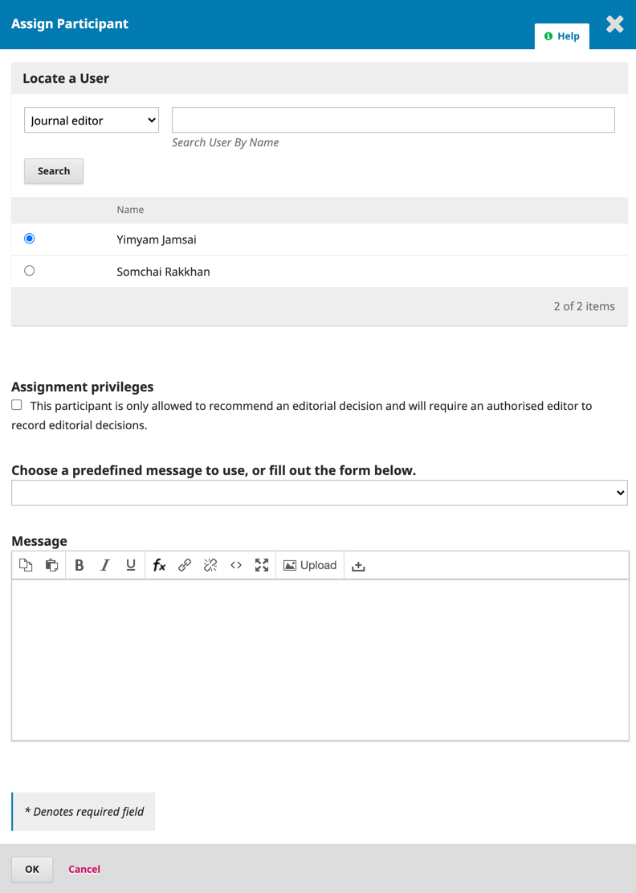

# FAQ ที่พบบ่อยๆ ThaiJO2.0

## 1. เคยเป็นสมาชิกวารสารหนึ่งใน ThaiJO และต้องการเป็นสมาชิกอีกวารสารใน ThaiJO แต่ใช้ Username,Password เดิมเข้าสู่ระบบไม่ได้ หรือ User แจ้งว่าเป็นสมาชิก ThaiJO อยู่แล้ว แต่วารสารค้นหาไม่เจอ <a id="1-thaijo-thaijo-username-password-user-thaijo"></a>

**ตอบ**‌

เนื่องจากระบบ ThaiJO อัพเดทใหม่ และได้ทำการแบ่ง server เป็นหลายๆโดเมน ทำให้วารสารแยกกันคนละโดเมน ซึ่ง user จะใช้ร่วมกันเฉพาะวารสารในโดเมนเดียวกันเท่านั้น หากอยู่คนละโดเมน user ก็จะแยกกันด้วย สังเกตจากลิงก์วารสาร เช่น so01.tci-thaijo.org, so02.tci-thaijo.org, li01.tci-thaijo.org, he02.tci-thaijo.org เป็นต้น แสดงว่าวารสารอยู่คนละโดเมน‌

ถ้าวารสารอยู่โดเมนเดียวกันไม่ต้องสมัครใหม่ ให้เข้าที่เว็บวารสารแล้วเพิ่ม Role Author ใน Profiles \([คลิก](https://drive.google.com/file/d/1fQ_q9Q8nc9AAUChjLNdZTKbUgv4ElNm1/view)\) แต่ถ้าอยู่คนละโดนเมน วิธีแก้ไขคือ เข้าเว็บวารสารและสมัครสมาชิกใหม่ โดยท่านสามารถใช้ username, password และ email เดิมได้‌

​[https://drive.google.com/file/d/1chnRa8qINtc4zFKGV\_zLfHD5PYTg5XHE/view](https://drive.google.com/file/d/1chnRa8qINtc4zFKGV_zLfHD5PYTg5XHE/view)​​‌


## 2. ไม่สามารถ log in เข้าสู่ระบบได้ <a id="2-log-in"></a>

**ตอบ**‌

เนื่องจาก User ยังไม่ได้ยืนยันตัวตน‌

วิธีที่ 1 ดำเนินการการโดยท่านเอง : ให้ User เข้าสู่อีเมลของตนเอง แล้วค้นหาอีเมล เรื่อง “Validate Your Account” จากนั้นให้คลิกที่ลิงก์ในอีเมล ถ้าไม่เจออีเมลในกล่องจดหมาย ให้ตรวจสอบที่ จดหมายขยะ \(Spam Mails\) หรือ ถังขยะ \(Junk Mails\)‌

วิธีที่ 2 ดำเนินการโดยแอดมินวารสาร : Journal Manager หรือ Journal Editor วารสารเป็นผู้ยืนยันตัวตนให้ โดยเข้าไปที่ Users & Roles &gt;&gt; Users &gt;&gt; Search หา User &gt;&gt; เมื่อเจอแล้ว คลิกหัวลูกศรหน้าชื่อ User &gt;&gt; คลิก enable ให้ขึ้นเป็น disable‌

## 3. ส่งอีเมลแจ้งผู้แต่งเพื่อให้แก้ไขบทความไม่ได้ \(Request Revisions\)‌ <a id="3-request-revisions"></a>


**ตอบ**‌

เนื่องจากขนาดไฟล์ที่แนบมีขนาดใหญ่เกินกว่าจะส่งออกอีเมล ทางแก้ไขคือไม่ต้องเลือกไฟล์ที่หัวข้อ Select review files to share with the author\(s\) เพื่อให้ระบบสามารถส่งอีเมลแจ้งผู้แต่งได้ จากนั้นสร้างกระทู้สนทนา \(Discussion\) และแนบไฟล์ผลประเมินให้กับผู้แต่งทางนี้แทน‌

## 4. กดสร้างการประเมินรอบ 2 แล้ว สามารลบหรือแก้ไขได้หรือไม่ <a id="4-2"></a>

**ตอบ**‌

ไม่ได้ เนื่องจาก ระบบเดินหน้าแล้ว กลับมาแก้ไขย้อนหลังไม่ได้ ดังนั้น สถานะปัจจุบันของบทความคือ การประเมินรอบที่ 2 ดังนั้นให้รอผลประเมินจากผู้ประเมินให้ครบทั้ง 2 ท่านจากรอบที่ 1 แล้วกดปุ่มตัดสินบทความในรอบที่ 2‌

## 5. การเพิ่ม/ลด ตำแหน่งให้กับ user ทำอย่างไร \(user จะต้องอยู่โดเมนเดียวกันกับวารสาร\) <a id="5-user-user"></a>

**ตอบ**‌

ขั้นตอนที่ 1 ค้นหา User : User&Roles &gt; User &gt; Search &gt; พิมพ์คำค้น &gt; กดปุ่ม Search‌

_\(ถ้า user อยู่นอกวารสารให้เลือก Include users with no roles in this journal. แต่ถ้าเป็นสมาชิกในวารสารไม่ต้องเลือก\)_‌


ขั้นตอนที่ 2 แต่งต้ังตำแหน่ง : คลิกหัวลูกศร \(▶️\) &gt; Edit Role &gt; เลือกตำแหน่ง &gt; Save​‌


## 6. ถ้า reviewer มี user ในระบบแล้วจะดึงมาเป็น reviewer วารสารอย่างไร \(reviewer จะต้องอยู่โดเมนเดียวกันกับวารสาร\) <a id="6-reviewer-user-reviewer-reviewer"></a>

**ตอบ**‌

ให้เข้าไปยังบทความที่ต้องการให้ท่านประเมินบทความก่อน‌

จากนั้น ทำตามขั้นตอนหน้า 101 [https://drive.google.com/file/d/1\_NRysB6dFMZaF9z3pBOrds0a30k7b7RH/view](https://drive.google.com/file/d/1_NRysB6dFMZaF9z3pBOrds0a30k7b7RH/view)​‌

## 7. Journal Editor หรือ Section Editor ไม่มีปุ่มตัดสินบทความ‌ <a id="7-journal-editor-section-editor"></a>


**ตอบ**‌

เนื่องจากตอน Assign ผู้ดูแลบทความ ทำการเลือกให้ผู้ดูแลบทความไม่มีสิทธิ์ตัดสินบทความ‌

วิธีการแก้ไข ดังนี้‌

1.ที่หัวข้อ Participants ให้คลิกลูกศรหน้าชื่อ Journal Editor หรือ Section Editor แล้วกด Remove ออก   
__2. Assign‌


3. เลือกผู้ที่ต้องการให้ดูแลบทความ **โดยไม่ต้องเลือกที่หัวข้อ Assignment privileges**  
4. OK‌




**ห้ามเลือกหัวข้อ Assignment privileges**


## 8. วารสารต้องการใช้งานระบบ ThaiJO ต้องทำอย่างไร <a id="8-thaijo"></a>

**ตอบ**‌

มี 2 กรณี ดังนี้‌

**1. สำหรับวารสารที่ต้องการอบรมการใช้งานระบบ ::**‌

* ดูรายละเอียดเพิ่มเติมได้ที่ : [https://tci-thailand.org/?p=1361](https://tci-thailand.org/?p=1361) และทางทีม ThaiJO จะทำการเปิดระบบให้กับวารสารในวันสุดท้ายของการอบรม แต่เนื่องด้วยสถานการณ์โควิด ตอนนี้ทางทีมยังไม่สามารถเปิดรอบอบรมได้

**2. สำหรับวารสารที่ไม่ต้องการอบรมการใช้งานระบบ ::**‌

* แจ้งขอเปิดใช้งานระบบ ThaiJO ไปยังอีเมล [thaijo@nectec.or.th](mailto:thaijo@nectec.or.th) จากนั้นผู้ประสานงานจะส่งฟอร์มให้กรอกข้อมูล โดยกำหนดการเปิดวารสารคือวันที่ 15 และ 30 ของทุกเดือน
* หลังจาก จนท. เปิดระบบให้เรียบร้อยแล้ว วารสารสามารถใช้งานระบบได้ทันที และภายใน 2-3 เดือน จะมีหนังสือเรียกเก็บค่าบริการส่งไปยังอีเมลผู้ขอเปิดใช้ระบบหรืออีเมลติดต่อวารสาร สำหรับปี 2564 นี้ จะมีค่าธรรมเนียม 5,350 บาท รวม vat 7% เรียบร้อยแล้ว ซึ่งค่าบริการของทุกวารสารในระบบ ThaiJO จะสิ้นสุดพร้อมกันคือวันที่ 31 ธันวาคม 2564
* ปี 2565 จะเรียกเก็บแบบ 2 ปีครั้ง คือ 10,000 บาท ยังไม่รวม vat \(vat จะขึ้นอยู่กับประกาศรัฐบาลในปีงบนั้นๆ\) โดยค่าบริการครอบคลุมการใช้งานสำหรับปี 2565 และ 2566


การเรียกเก็บค่าบริการ ThaiJO จะเรียกเก็บฯแบบ 2 ปี/ครั้ง จำนวนเงิน 10,000 บาท ยังไม่รวม VAT \(VAT จะขึ้นอยู่กับประกาศรัฐบาลในปีงบนั้นๆ\)


## 9. วารสารในฐานข้อมูล TCI เปลี่ยนบรรณาธิการวารสาร ต้องทำอย่างไร <a id="9-tci"></a>

**ตอบ**‌

1. แจ้งเปลี่ยนแปลงบรรณาธิการวารสารไปยังอีเมล [tci.thai@gmail.com](mailto:tci.thai@gmail.com) เพื่อทาง TCI จะได้ดำเนินการแก้ไขข้อมูลในฐานข้อมูล TCI‌

2. สำหรับระบบ ThaiJO ของวารสาร ทางวารสารสามารถแก้ไขข้อมูลได้เอง ดังนี้‌

_การเปลี่ยนแปลงข้อมูลเว็บไซต์_ :‌

*  Settings &gt; Journal &gt; Masthead &gt; Editorial Team \(กรอกข้อมูลบรรณาธิการและกองบรรณาธิการใหม่\)
* Settings &gt; Journal &gt; Contact &gt; Principal Contact \(กรอกข้อมูลบรรณาธิการใหม่\)
* Settings &gt; Website &gt; Plugins &gt; Custom Block Manager &gt; คลิกหัวลูกศร &gt; Manage Custom Blocks &gt; คลิกหัวลูกศร JournalInfo &gt; Edit &gt; \(กรอกข้อมูลบรรณาธิการใหม่\)

_การเปลี่ยนแปลงตำแหน่งของ User_ :‌

* Users & Roles &gt; Users &gt; Search หา User &gt; เมื่อเจอแล้ว คลิกหัวลูกศรหน้าชื่อ User &gt; Edit Role &gt; คลิกเพิ่มตำแหน่ง หรือ ยกเลิกตำแหน่งให้กับ User

## 10. การเพิกถอนบทความออกจากวารสาร \(RETRACTED ARTICLE\) <a id="10-retracted-article"></a>

**ตอบ**‌

การดำเนินการเพื่อให้มีการแสดงผลทั้งต่อผู้อ่านเว็บไซต์ทั่วไป และระบบ index ต่างๆ ค้นเจอและทราบว่าบทความนี้ถูกเพิกถอนแล้ว มีขั้นตอน ดังนี้‌

**ขั้นตอนที่ 1** เปลี่ยนชื่อบทความ \(ใน Metadata หรือ เว็บไซต์วารสาร\) โดยเพิ่มคำว่า RETRACTED ARTICLE: ชื่อบทความ หรือ RETRACTED: ชื่อบทความ \(สำหรับภาษาไทย เช่น บทความถูกเพิกถอน, บทความถูกถอดถอน เป็นต้น\)‌

_ตัวอย่าง_‌

* ​[https://www.thelancet.com/journals/lancet/article/PIIS0140-6736\(97\)11096-0/fulltext](https://www.thelancet.com/journals/lancet/article/PIIS0140-6736%2897%2911096-0/fulltext)​
* ​[https://link.springer.com/article/10.1007%2Fs13277-012-0340-4](https://link.springer.com/article/10.1007%2Fs13277-012-0340-4)​

**ขั้นตอนที่ 2** เปลี่ยนไฟล์ full paper ใหม่ \(ห้ามลบ pdf แต่ ใช้การ Change file ใน galley pdf\) โดยไฟล์ใหม่ คาดลายน้ำ RETRACTED ARTICLE เพื่อให้ทราบว่าบทความถูกเพิกถอน‌

_ตัวอย่าง_‌

* ​[https://www.thelancet.com/action/showPdf?pii=S0140-6736%2897%2911096-0](https://www.thelancet.com/action/showPdf?pii=S0140-6736%2897%2911096-0)​

**ขั้นตอนที่ 3** เขียนบทบรรณาธิการในเล่มหน้า หรือ จัดทำ Section เพิ่มเติม เช่น Retraction Note หรือ comment โดยระบุว่ามีบทความเรื่อง ปีที่ ฉบับที่ เลขหน้า ว่าถูกเพิกถอนด้วยเหตุผลใด โดยเอกสารฉบับนี้ ให้ References บทความที่เพิกถอน และ เนื้อหาจริยธรรมการตีพิมพ์ของวารสาร กรณีที่มีความผิดด้านทางจริยธรรม‌

_ตัวอย่าง_‌

* ​[https://www.thelancet.com/journals/lancet/article/PIIS0140-6736\(10\)60175-4/fulltext](https://www.thelancet.com/journals/lancet/article/PIIS0140-6736%2810%2960175-4/fulltext)​

เว็บไซต์สำหรับให้ค้นบทความที่ถูกถอน: [http://retractiondatabase.org/RetractionSearch.aspx?](http://retractiondatabase.org/RetractionSearch.aspx?)​‌

## **11.** การสร้างเหรียญกลุ่มวารสารในฐานข้อมูล TCI ใน ThaiJO <a id="11-tci-thaijo"></a>

**ตอบ**‌

**เข้าไปที่เมนู :: Setting &gt; Website &gt; Plugins &gt; Custom Block Manager &gt; คลิกหัวลูกศร &gt; Manage Custom Blocks &gt; Add Block**‌

จากนั้นทำตามขั้นตอน ดังนี้ 1. กรอก Block Name : JournalInfo 2. คลิก &lt;&gt; เพื่อวาง Source Code​‌


3. วาง Source Code และแก้ไขชื่อ Editor  
4. OK​‌


**Source Code :** 

```text
<p class="title">Journal Information</p> 
<div class="content">
<a href="/public/api/infoTier.php" target="_blank" rel="noopener"></a>
<div style="display: block; width: 100%; overflow: auto; margin: 1em 0 1em 0;"> 
<a style="display: block; float: left; line-height: 1.5em; font-size: 1em;" href="https://tci-thailand.org/list%20journal.php" target="_blank" rel="noopener">Indexed in TCI</a>

</div>
<p>Editor : Dr. Sara Kahm (แก้ไขเป็นชื่อบรรณาธิการวารสาร)</p>
</div>‌
```

5. Save


​ 

