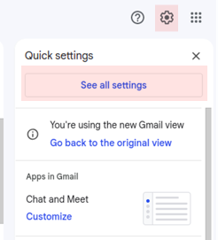
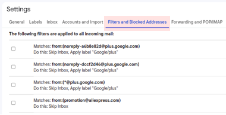
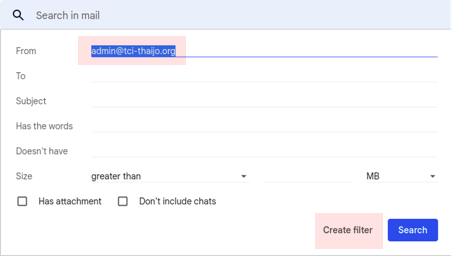
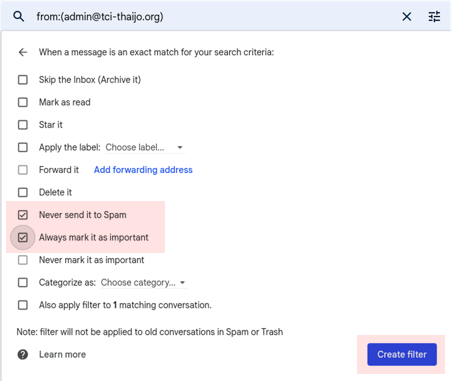
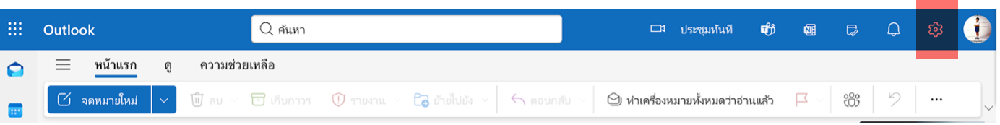

# 16. ไม่ได้รับอีเมลจากระบบ ThaiJO ต้องทำอย่างไร

### 📧 <mark style="color:red;background-color:yellow;">การตั้งค่า Whitelist สำหรับ Gmail</mark>

1. ลงชื่อเข้าใช้อีเมลของท่าน
2. คลิกไอคอน **⚙️ การตั้งค่า (Settings)** ที่มุมขวาบน → เลือก **See all settings**

<figure><figcaption></figcaption></figure>

3. ไปที่แท็บ **Filters and Blocked Addresses**

<figure><figcaption></figcaption></figure>

4. คลิก **Create a new filter**

<figure><figcaption></figcaption></figure>

5. ในช่อง **From** กรอก: <mark style="color:blue;">**`admin@tci-thaijo.org`**</mark>  → คลิก **Create filter**

<figure><figcaption></figcaption></figure>

5. เลือกตัวเลือกตามภาพ → คลิก **Create filter**

<figure><figcaption></figcaption></figure>

***

### 📧 <mark style="color:red;background-color:yellow;">การตั้งค่า Whitelist สำหรับ Hotmail / Outlook</mark>

1. ลงชื่อเข้าใช้อีเมลของท่าน
2. คลิกไอคอน **⚙️ การตั้งค่า (Settings)** ที่มุมขวาบน → เลือก **View all Outlook settings**

<figure><figcaption></figcaption></figure>

3. ในหน้าต่างการตั้งค่า ให้เลือก
   * **จดหมาย (Mail)**
   * เลือก **อีเมลขยะ (Junk email)**
   * ภายใต้หัวข้อ ผู้ส่งและโดเมนที่ปลอดภัย (Safe senders and domains)
   * คลิกปุ่ม **+ เพิ่มผู้ส่งที่ปลอดภัย (+Add)**
   * &#x20;กรอก: <mark style="color:blue;">**`admin@tci-thaijo.org`**</mark>&#x20;
   * กดปุ่ม ตกลง (OK)

<figure><figcaption></figcaption></figure>

4. กดปุ่ม บันทึก (Save)

<figure><figcaption></figcaption></figure>

\
\
\
