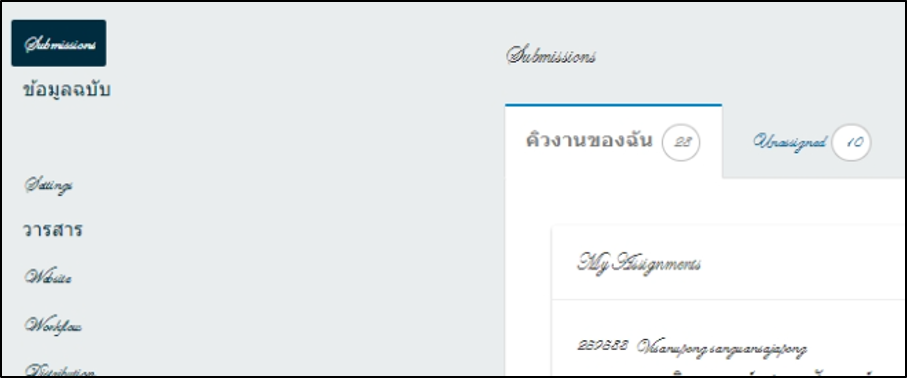

# 21. หน้าเว็บตัวอักษรอ่านไม่ออก ต้องทำอย่างไร

<figure><figcaption></figcaption></figure>

### <mark style="color:$success;">สาเหตุที่พบ</mark>

เครื่องคอมพิวเตอร์ของผู้ใช้อาจมีการติดตั้งฟอนต์เพิ่มเติม หรือฟอนต์ที่ใช้บนเว็บไม่ตรงกับฟอนต์ในระบบปฏิบัติการ ทำให้ตัวอักษรบนหน้าเว็บอ่านไม่ถูกต้อง

***

### ✅ <mark style="color:$success;">**วิธีการจัดการ**</mark>

#### 1️⃣ **เปลี่ยนเครื่องลองเปิดเว็บอีกเครื่อง**

* ถ้าเว็บแสดงตัวอักษรได้ปกติ แสดงว่าปัญหาเกิดจากฟอนต์บนเครื่องเดิม

#### 2️⃣ **ลบฟอนต์ที่ติดตั้งเพิ่มเติมในเครื่อง**

* ไปที่ `Windows → Fonts`
* ค้นหาและลบฟอนต์ที่เกี่ยวข้องกับ **“Dusit”** เช่น `DSN Dusit`, `Dusit XXX` เป็นต้น
* ลองเปิดเว็บใหม่อีกครั้ง

#### 3️⃣ **ติดตั้งฟอนต์ใหม่**

* ลบฟอนต์เก่าทั้งหมด&#x20;
* ติดตั้งฟอนต์ใหม่ทั้งหมด โดยสามารถ **ดาวน์โหลดไฟล์ฟอนต์** หรือ **คัดลอกจากเครื่องอื่น** มาติดตั้งใหม่

#### 4️⃣ **ติดตั้ง Windows ใหม่** (ถ้า 3 ข้อก่อนหน้านี้ไม่สำเร็จ)

* เป็นวิธีสุดท้ายในกรณีฟอนต์เสียหายหรือระบบมีปัญหา


💡**คำแนะนำเพิ่มเติม:**

* หลีกเลี่ยงการติดตั้งฟอนต์ที่ไม่จำเป็นบนเครื่อง
* ใช้ฟอนต์เดียวกับที่เว็บกำหนด เช่น Dusit หรือฟอนต์ระบบ
* หลังติดตั้งฟอนต์ใหม่ ให้รีสตาร์ทเบราว์เซอร์ก่อนลองเปิดเว็บอีกครั้ง

