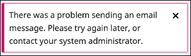

# 5. ส่งอีเมลแจ้งผู้แต่งให้แก้ไขบทความ (Request Revisions) ไม่ได้

<figure><figcaption></figcaption></figure> <figure><figcaption></figcaption></figure>

### <mark style="color:$success;">สาเหตุ</mark>

มีการ**เลือกส่งไฟล์ 📎ในหัวข้อ Select review files to share with the author(s)** ซึ่งไฟล์ที่เลือกนั้นจะถูกแนบส่งไปทางอีเมล หาก<mark style="color:red;">**ไฟล์มีขนาดใหญ่เกินไป**</mark> _หรือ_ <mark style="color:red;">**กล่องอีเมลของผู้แต่งใกล้เต็ม**</mark> → <mark style="color:red;background-color:yellow;">**อีเมลจึงส่งออกไม่สำเร็จ**</mark>

### ✅ <mark style="color:$success;">วิธีการจัดการ (เลือกทำได้ 2 วิธี)</mark>

### <mark style="color:red;background-color:yellow;">**👉 วิธีที่ 1 : แนบไฟล์ผลประเมินทางกระทู้สนทนา (Review Discussion)**</mark>

1️⃣ เข้า Request Revisions → กด Record Editorial Decision โดย _<mark style="color:red;">ไม่เลือกไฟล์</mark>_ ที่หัวข้อ Select review files to share with the author(s) เพื่อส่งเฉพาะข้อความแจ้งผู้แต่งให้แก้ไขบทความ

2️⃣ สร้าง Review Discussion และแนบไฟล์ผลประเมินส่งให้ผู้แต่งทางนี้แทน

***

### <mark style="color:red;background-color:yellow;">**👉 วิธีที่ 2 : เข้า Request Revisions และกด Record Editorial Decision 2 ครั้ง**</mark>

1️⃣ ครั้งที่ 1 : เข้า Request Revisions → กด Record Editorial Decision โดย _<mark style="color:red;">ไม่เลือกไฟล์</mark>_ ที่หัวข้อ Select review files to share with the author(s) เพื่อส่งเฉพาะข้อความแจ้งผู้แต่งให้แก้ไขบทความ

2️⃣ ครั้งที่ 2 : เข้า Request Revisions อีกครั้ง → _<mark style="color:red;">เลือกไฟล์</mark>_ ที่หัวข้อ Select review files to share with the author(s) → กด Record Editorial Decision

> 📌 ครั้งที่ 1 = อีเมลส่งออกโดยไม่มีไฟล์แนบ
>
> 📌 ครั้งที่ 2 = ผู้แต่งเห็นไฟล์ผลประเมินในระบบ แต่อีเมลจะไม่ถูกส่งออก


**ข้อควรระวัง (วิธีที่ 2)**

* ไฟล์ที่ผู้แต่งเห็นในระบบ คือไฟล์ที่อัปโหลดในหัวข้อ **Reviewer Files** (Review Details ของผู้ประเมินแต่ละท่าน) ซึ่งอาจมีข้อมูลระบุตัวตนของผู้ประเมิน
* ไฟล์ที่**อัปโหลดใหม่**ในหัวข้อ Select review files to share with the author(s) → ผู้แต่ง **ไม่เห็นในระบบ** แต่จะถูกส่งเป็น **ไฟล์แนบในอีเมล**
* เมื่อผู้แต่งอัปโหลดไฟล์บทความฉบับแก้ไข → ระบบจะแสดง **ชื่อไฟล์ใหม่**ที่อัปโหลดใหม่ในหัวข้อ Select review files... แม้ผู้แต่งจะเปิดดูไฟล์จากระบบไม่ได้

