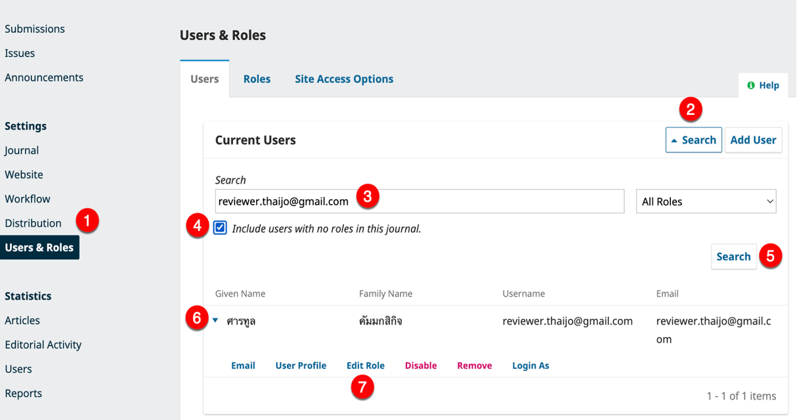
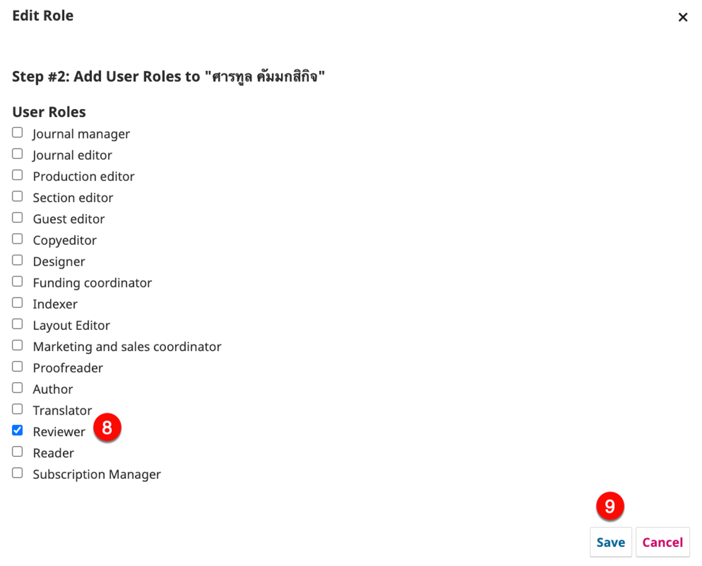
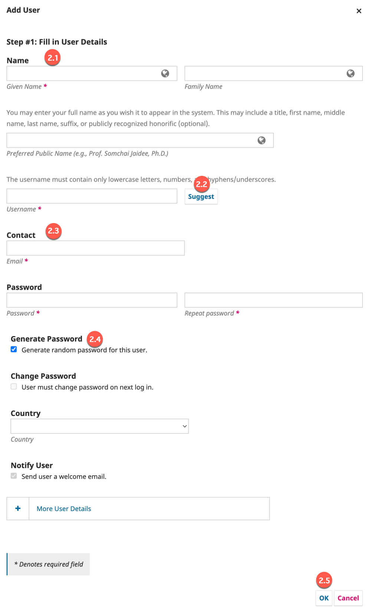

# 9. การเพิ่มผู้ประเมินที่มีบัญชีผู้ใช้อยู่ในระบบ ThaiJO แล้วให้เป็นผู้ประเมินของวารสาร

เนื่องจากระบบ ThaiJO ได้มีการปรับปรุงระบบและขยายโดเมนเป็นจำนวน 35 โดเมน

<mark style="color:red;">**การเพิ่มผู้ประเมินจึงแบ่งออกเป็น 2 กรณี**</mark> ดังนี้

### <mark style="color:green;">✅</mark> <mark style="color:$success;">วิธีการจัดการ</mark>

### <mark style="color:red;background-color:yellow;">**กรณีที่ 1: ผู้ประเมิน (Reviewer) อยู่ในโดเมนเดียวกันกับวารสาร**</mark>

1. ไปที่เมนู **ผู้ใช้และตำแหน่ง (Users & Roles)**
2. คลิกที่ปุ่ม **ค้นหา (Search)**
3. กรอก **อีเมลของผู้ประเมิน (Reviewer)** ในช่องค้นหา
4. เลือก **ค้นหาผู้ใช้จากวารสารอื่นภายในโดเมนเดียวกัน (Include users with no roles in this journal.)**
5. คลิกที่ปุ่ม **ค้นหา (Search)**
6. คลิกที่ **ไอคอนหัวลูกศร** ▶️ หน้าชื่อ
7. เลือก **แก้ไขบทบาท (Edit Role)**
8. เลือกบทบาท **ผู้ประเมิน (Reviewer)**&#x20;
9. คลิก **บันทึก (Save)** เพื่อยืนยันการเพิ่มบทบาท

<figure><figcaption></figcaption></figure> <figure><figcaption></figcaption></figure>

***

### <mark style="color:red;background-color:yellow;">กรณีที่ 2: ผู้ประเมิน (Reviewer) ไม่ได้อยู่ในโดเมนเดียวกันกับวารสาร</mark>


หากค้นหาไม่พบจากกรณีที่ 1 เนื่องจากผู้ประเมิน (Reviewer) เป็นสมาชิกของวารสารอื่นที่**ไม่ได้อยู่ในโดเมนเดียวกันกับวารสาร** ให้ดำเนินการ **เพิ่มผู้ใช้ใหม่** โดย**ใช้อีเมลเดิม**


1\. ไปที่เมนู **ผู้ใช้และตำแหน่ง (Users & Roles)** → **เพิ่มผู้ใช้ (Add User)**

<figure><figcaption></figcaption></figure>

2\. กรอกข้อมูลของผู้ประเมิน ดังนี้

&#x20; 2.1 กรอก **ชื่อ (Given Name)** และ **นามสกุล (Family Name)**

&#x20; 2.2 ในช่อง ชื่อผู้ใช้ (Username) → กดปุ่ม **แนะนำ (Suggest)** เพื่อให้ระบบสร้างชื่อผู้ใช้ให้อัตโนมัติ

&#x20; 2.3 กรอก **อีเมล (Email)** โดย<mark style="color:red;">**ใช้อีเมลเดียวกับที่ผู้ประเมิน (Reviewer)ใช้ในวารสารอื่น**</mark>

&#x20; 2.4 เลือก **สร้างรหัสผ่านแบบสุ่มสำหรับผู้ใช้นี้ (Generate random password for this user.)**

&#x20; 2.5 กดปุ่ม **ตกลง (OK)** เมื่อบันทึกข้อมูลแล้ว ระบบจะเพิ่มท่านเป็นสมาชิกในโดเมนของวารสาร

3. เลือกบทบาท **ผู้ประเมิน (Reviewer)**
4. คลิก **บันทึก (Save)** เพื่อยืนยันการเพิ่มบทบาท

<figure><figcaption></figcaption></figure> <figure><figcaption></figcaption></figure>


**หมายเหตุ**

การเข้าสู่ระบบ (Login) จะ**ไม่ใช้ Username & Password** ที่ตั้งค่าไว้ในวารสาร แต่จะใช้ **Email & Password** ที่ผู้ประเมิน (Reviewer) ใช้งานกับวารสารอื่น ๆ ผ่านระบบ **Single Sign-On (SSO)**

