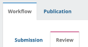
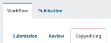
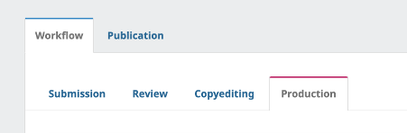

---
layout:
  width: default
  title:
    visible: true
  description:
    visible: false
  tableOfContents:
    visible: true
  outline:
    visible: true
  pagination:
    visible: true
  metadata:
    visible: true
---

# 14. ไม่สามารถเผยแพร่บทความได้ ต้องทำอย่างไร

### <mark style="color:$success;">**สาเหตุที่พบ**</mark> 

### <mark style="color:red;background-color:yellow;">**1.**</mark> <mark style="color:red;background-color:yellow;"></mark><mark style="color:red;background-color:yellow;">บทบาทของผู้ใช้งานไม่มีสิทธิ์</mark> 

* **ผู้จัดการวารสาร (Journal manager: JM)** → ไม่สามารถดำเนินการใด ๆ กับบทความได้
* **บรรณาธิการประจำบท/เรื่อง (Section editor: SE)** → ไม่สามารถเผยแพร่บทความได้

<figure><figcaption></figcaption></figure> <figure><figcaption></figcaption></figure>

#### <mark style="color:green;">✅</mark> <mark style="color:green;"></mark><mark style="color:green;">**วิธีแก้ไข:**</mark>

* ให้**ผู้ใช้ท่านอื่น**ที่มีตำแหน่ง **บรรณาธิการ (Journal editor: JE)** เป็นผู้แก้ไขข้อมูลบทความและเผยแพร่บทความแทน

_**หรือ**_

* แต่งตั้งให้ผู้ใช้นั้นเป็นตำแหน่ง **บรรณาธิการ (Journal editor: JE)**
* หัวข้อ **ผู้มีส่วนเกี่ยวข้อง (Participants)** → มอบหมาย (Assign)  เป็นผู้ดูแลบทความ

<figure><figcaption></figcaption></figure>

📌 **ตัวอย่าง:**&#x20;

**Somchai Rakkhan** คือผู้ดูแลบทความในตำแหน่ง**บรรณาธิการ (Journal editor: JE)** ที่กำหนดสิทธิ์ให้สามารถจัดการข้อมูลบทความได้

***

### <mark style="color:red;background-color:yellow;">**2. สิทธิ์ของผู้ดูแลบทความ**</mark><mark style="color:red;background-color:yellow;">ถูกจำกัด</mark> 

* หากกำหนดสิทธิ์ของผู้ดูแลบทความให้ <mark style="color:red;">**ไม่มีสิทธิ์ตัดสินบทความโดยตรง**</mark> ระบบจะไม่อนุญาตให้จัดการข้อมูลของบทความ

<figure><figcaption></figcaption></figure> <figure><figcaption></figcaption></figure>

#### <mark style="color:green;">✅</mark> <mark style="color:green;"></mark><mark style="color:green;">**วิธีแก้ไข:**</mark>

1. กระบวนการ (Workflow)  → **ผู้มีส่วนเกี่ยวข้อง (Participants)**
2. **คลิกลูกศร**หน้าชื่อบรรณาธิการ (Journal editor: JE) → เลือก **แก้ไข (Edit)**
3. หัวข้อ **กำหนดสิทธิ์ (Assignment privileges)** → **เอาเครื่องหมายออก**
4. คลิก **ตกลง (OK)**

<figure><figcaption></figcaption></figure> <figure><figcaption></figcaption></figure>

***

### <mark style="color:red;background-color:yellow;">3. บทความยังไม่ถึงขั้นตอนการผลิตเอกสาร (Production)</mark>

<figure><figcaption></figcaption></figure>

* บทความที่สามารถเผยแพร่ได้ จะต้องอยู่ในขั้นตอน <mark style="color:red;">**"การผลิตเอกสาร (Production)"**</mark> เท่านั้น ซึ่งเป็นขั้นตอนสุดท้ายก่อนการเผยแพร่

#### <mark style="color:green;">✅</mark> <mark style="color:green;"></mark><mark style="color:green;">**วิธีแก้ไข:**</mark>

1. <mark style="background-color:$success;">**ขั้นตอนการประเมิน (Review)**</mark>
   * กดปุ่ม **รับตีพิมพ์บทความ (Accept Submission)**&#x20;
   * ส่งบทความเข้าสู่ขั้นตอน การตรวจต้นฉบับ (Copyediting)

<figure><figcaption></figcaption></figure> <figure><figcaption></figcaption></figure>

2. <mark style="background-color:$success;">**ขั้นตอนการตรวจต้นฉบับ (Copyediting)**</mark>
   * หากไม่ได้มีการดำเนิน → กดปุ่ม **ส่งไปขั้นตอนการผลิต (Sent to Production)**
   * หากมีการดำเนินการ → มอบหมายบรรณาธิการต้นฉบับ (Copyeditor) และดำเนินการตรวจต้นฉบับให้เสร็จสิ้น  → กดปุ่ม **ส่งไปขั้นตอนการผลิต (Sent to Production)**
   * ส่งบทความเข้าสู่ขั้นตอน การผลิตเอกสาร (Production)

<figure><figcaption></figcaption></figure> <figure><figcaption></figcaption></figure>

3. <mark style="background-color:$success;">**ขั้นตอนการผลิตเอกสาร (Production)**</mark>
   * เมื่อถึงขั้นตอนนี้แล้ว การเผยแพร่ (Publication) จะสามารถนำบทความเข้าสู่ฉบับและเผยแพร่บทความได้

<figure><figcaption></figcaption></figure>
