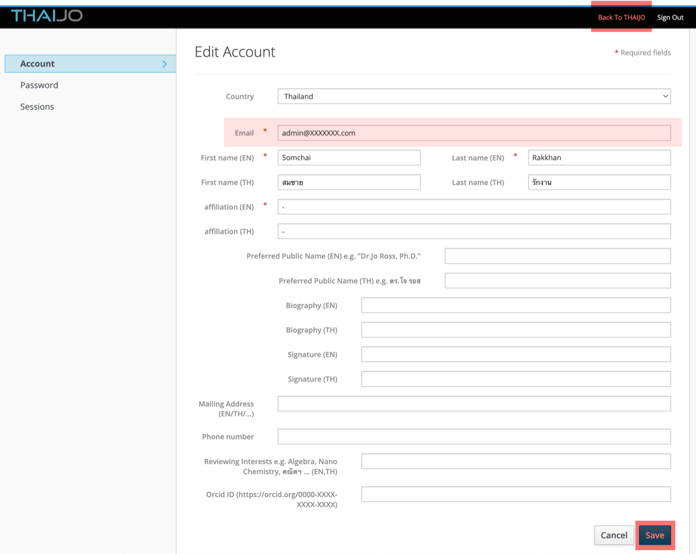

---
layout:
  width: default
  title:
    visible: true
  description:
    visible: false
  tableOfContents:
    visible: true
  outline:
    visible: true
  pagination:
    visible: true
  metadata:
    visible: true
---

# 4. การเปลี่ยนอีเมลของบัญชีผู้ใช้ | Change Your Email in the ThaiJO System


**ข้อควรระวัง:**&#x20;

โปรดดำเนินการให้ครบทุกขั้นตอนเพื่อป้องกันข้อผิดพลาด

**Important:**&#x20;

Please complete all steps to avoid any errors.


### <mark style="color:$success;">🔑</mark> <mark style="color:$success;"></mark><mark style="color:$success;">**ขั้นตอนการเปลี่ยนอีเมล | Steps to Change Your Email**</mark>


👉 ยกตัวอย่าง เช่น ต้องการเปลี่ยนอีเมลจากเดิม **`tci_admin@gmail.com`** เป็น **`admin@XXXXXXX.com`**


1. **เข้าสู่ระบบ** และไปที่เมนู **Edit Profile**\
   &#xNAN;_**Log in** and go to the **Edit Profile** menu._
2. ไปที่**แท็บ Email:**\
   &#xNAN;_&#x47;o to the **Email** tab:_
   *   ✏️ **แก้ไขเป็นอีเมลใหม่**ที่ท่านต้องการ

       _Edit your email to the new one._

       * 👉 ยกตัวอย่าง เช่น เปลี่ยนอีเมลจาก **`tci_admin@gmail.com`** → <mark style="color:blue;">**`admin@XXXXXXX.com`**</mark>\
         &#xNAN;_&#x45;xample: Change from_ **`tci_admin@gmail.com`** → <mark style="color:blue;">**`admin@XXXXXXX.com`**</mark>
   * 💾 กด **Save**\
     &#xNAN;_&#x43;lick **Save**._&#x20;

<figure><figcaption></figcaption></figure> <figure><figcaption></figcaption></figure>

3. ไปที่**แท็บ Identify**\
   &#xNAN;_&#x47;o to the **Identify** tab_
   *   คลิก **“Update Profile Click Me”**

       _Click **“Update Profile Click Me”**_

<figure><figcaption></figcaption></figure>

4. เข้าสู่หน้า Profile ของระบบ "Single Sign-On (SSO)"\
   &#xNAN;_&#x54;he system will redirect to the Single Sign-On (SSO) Profile page._
   * ✏️ **แก้ไขอีเมล**ใหม่อีกครั้ง ให้**ตรงกับอีเมลที่ระบุในขั้นตอนที่ 2**\
     &#xNAN;_&#x55;pdate the email to match exactly with the one entered in Step 2 under the Email tab_
     * 👉 ยกตัวอย่าง:  <mark style="color:blue;">**`admin@XXXXXXX.com`**</mark>\
       &#xNAN;_&#x45;xample:_ <mark style="color:blue;">**`admin@XXXXXXX.com`**</mark>
   * 💾 กด **Save**\
     &#xNAN;_&#x43;lick **Save**._&#x20;
   * คลิก **“Back to ThaiJO”**| \
     &#xNAN;_&#x43;lick the link **“Back to ThaiJO”**_

<figure><figcaption></figcaption></figure>

5. กลับมาที่หน้า **Profile ของวารสาร** → คลิก **Logout**\
   &#xNAN;_&#x47;o back to the Journal Profile page → Click **Logout**_
6. กลับไปที่หน้า **Single Sign-On (SSO)** → คลิก **Logout** อีกครั้ง\
   &#xNAN;_&#x52;eturn to the Single Sign-On (SSO) page → Click **Logout** again_

<figure><figcaption></figcaption></figure> <figure><figcaption></figcaption></figure>

7. **เข้าสู่เว็บไซต์วารสารอีกครั้ง ด้วยอีเมลใหม่**\
   &#xNAN;_&#x4C;og in to the journal website again using your new email._
   * เพื่อให้ข้อมูล Profile ที่แก้ไขใน SSO อัปเดตและแทนที่ข้อมูลเดิมในวารสาร\
     &#xNAN;_&#x54;his ensures that the updated Profile in SSO will overwrite the old Profile in the journal system._

<figure><figcaption></figcaption></figure>


**หมายเหตุ:** หากพบว่าขั้นตอนใดไม่ตรงตามคู่มือ โปรดส่งภาพหน้าจอทั้งหน้าให้กับแอดมินระบบ ThaiJO เพื่อตรวจสอบและแก้ไขต่อไป

**Note:** If any step does not match this guide, please send a full screenshot to the ThaiJO system administrator for further assistance.

📌 **ช่องทางติดต่อ | Contact**

* Facebook: [ThaiJO2.0](https://www.facebook.com/ThaiJo2.0)
* Line ID: **@135rfmha**

