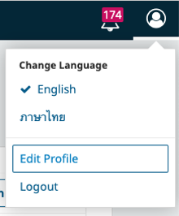
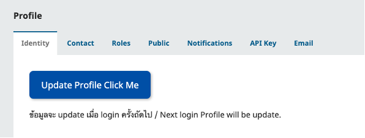
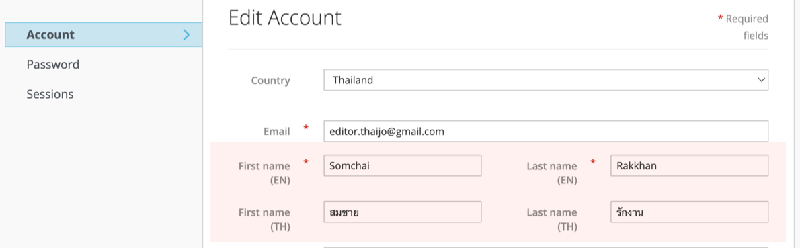
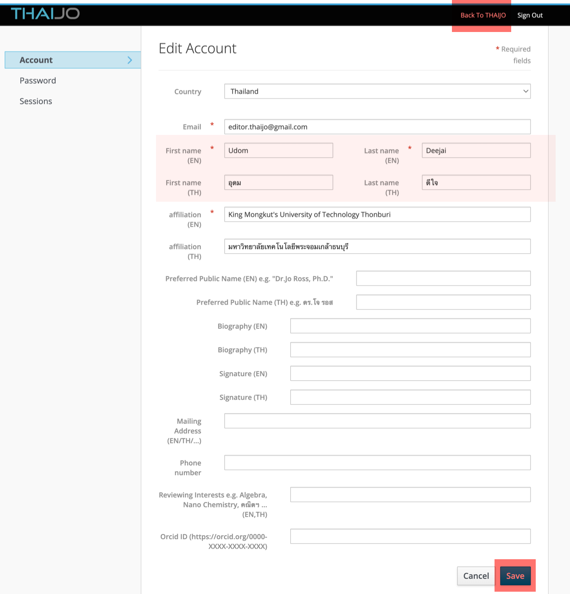

---
layout:
  width: default
  title:
    visible: true
  description:
    visible: false
  tableOfContents:
    visible: true
  outline:
    visible: true
  pagination:
    visible: true
  metadata:
    visible: true
---

# 10. วารสารเปลี่ยนบรรณาธิการใหม่ ต้องทำอย่างไร?

### <mark style="color:green;">✅</mark> <mark style="color:$success;">วิธีการจัดการ</mark>

### 1️⃣ **แจ้งข้อมูลไปที่ TCI (เฉพาะวารสารในฐานข้อมูล TCI)**


**หมายเหตุ**

สำหรับวารสารที่ยัง<mark style="color:red;">**ไม่ได้รับการบรรจุในฐานข้อมูล TCI**</mark> <mark style="color:red;">**ไม่ต้องดำเนินการ**</mark>ส่งอีเมลแจ้ง TCI


<figure><figcaption>
รายละเอียดวารสารในเว็บไซต์ฐานข้อมูล TCI: <a href="https://tci-thailand.org/">https://tci-thailand.org/</a>
</figcaption></figure>

<mark style="color:orange;">**ส่งอีเมลแจ้ง TCI**</mark> _(เฉพาะวารสารที่อยู่ในฐานข้อมูล TCI)_

* 📧 : [tci.thai@gmail.com](mailto:tci.thai@gmail.com)&#x20;

📎 **สิ่งที่ต้องแนบ:**

* หนังสือแต่งตั้งบรรณาธิการวารสารใหม่ อย่างเป็นทางการ
* เรียน หัวหน้าศูนย์ดัชนีการอ้างอิงวารสารไทย
* ระบุ **ชื่อ-สกุล บรรณาธิการใหม่** ให้ชัดเจน

***

### 2️⃣ แก้ไข**ข้อมูล**บนเว็บไซต์ ThaiJO ของวารสาร


วารสารสามารถดำเนินการได้เอง ตามขั้นตอนดังนี้


<mark style="color:orange;">**2.1 ข้อมูลรายชื่อบรรณาธิการและกองบรรณาธิการวารสาร**</mark>

<figure><figcaption></figcaption></figure>

* **ตั้งค่า (Settings)** → **วารสาร (Journal)** → **ข้อมูลวารสาร (Masthead)**&#x20;
* **ข้อมูลสำคัญ (Key Information)** → **กองบรรณาธิการ (Editorial Team)**
* กรอกข้อมูล **บรรณาธิการ (Editor-in-Chief)** **ใหม่** และ **กองบรรณาธิการ (Editorial Board) ใหม่**

***

<mark style="color:orange;">**2.2 ข้อมูลติดต่อวารสาร**</mark>

<figure><figcaption></figcaption></figure>

* **ตั้งค่า (Settings)** → **วารสาร (Journal)** → **ข้อมูลวารสาร (Masthead)**&#x20;
* **ติดต่อ (Contact)** → **หัวหน้ากองบรรณาธิการ (Principal Contact)**
* กรอกข้อมูล **บรรณาธิการ (Editor-in-Chief) ใหม่**

***

<mark style="color:orange;">**2.3 ข้อมูลลงท้ายอีเมลในระบบ**</mark> <mark style="color:red;">**(ถ้ามี)**</mark>

<figure><figcaption></figcaption></figure>

* **ตั้งค่า (Settings)** → **กระบวนการ (Workflow)** → **อีเมล (Email)**
* แก้ไข **ข้อความลงท้ายอีเมล (Signature)**

***

<mark style="color:orange;">**2.4 เมนูด้านขวามือในหน้าเว็บไซต์**</mark> <mark style="color:red;">**(ถ้ามี)**</mark>

<figure><figcaption></figcaption></figure>

* **ตั้งค่า (Settings)** → เว็บไซต์ (**Website)** → **ปลั๊กอิน (Plugins)** → **Custom Block Manager**
* คลิกหัวลูกศร ▶️ **Manage Custom Blocks**
* คลิกหัวลูกศร ▶️ **ชื่อ Block** ที่สร้างไว้ เช่น _JournalInfo_ หรือชื่อที่วารสารสร้างไว้ → **แก้ไข (Edit)**
* กรอกข้อมูล **บรรณาธิการ (Editor-in-Chief) ใหม่**

***

### 3️⃣ **เพิ่ม/ลดตำแหน่งบรรณาธิการวารสารของผู้ใช้ (User) และ/หรือแก้ไขข้อมูลของผู้ใช้ (User)**


วารสารสามารถดำเนินการได้เอง ตามขั้นตอนดังนี้


<mark style="color:orange;">**3.1 กรณีบัญชึผู้ใช้ (User) ใช้อีเมลส่วนตัว**</mark>


[editrole.md](editrole.md)


***

**3.2&#x20;**<mark style="color:orange;">**กรณีบัญชึผู้ใช้ (User)**</mark>**&#x20;ใช้อีเมลกลางของวารสาร**

<figure><figcaption></figcaption></figure> <figure><figcaption></figcaption></figure>

* Login เข้าสู่ระบบด้วย **อีเมลกลางของวารสาร** (ปัจจุบันยังแสดงชื่อบรรณาธิการเดิม: **Somchai Rakkhan**)
* ไปที่ **แก้ไขข้อมูลส่วนตัว (Edit Profile)** → **Update Profile Click Me**

<figure><figcaption></figcaption></figure> <figure><figcaption></figcaption></figure>

*   เข้าสู่หน้า Profile ของระบบ "Single Sign-On (SSO)"

    * แก้ไข **ชื่อ–นามสกุล** เป็น**บรรณาธิการใหม่**
    * **Save**
    * **Back to TAHIJO**

    📌 **ตัวอย่าง**&#x20;

    บัญชีผู้ใช้ (User) ที่ใช้อีเมลกลาง editor.thaijo@gmail.com\
    ได้เปลี่ยนบรรณาธิการจาก **Somchai Rakkhan** เป็น Udon Deejai บรรณาธิการใหม่&#x20;

<figure><figcaption></figcaption></figure> <figure><figcaption></figcaption></figure>

* กลับมาที่หน้า **Profile ของวารสาร** → คลิก **Logout**
* กลับไปที่หน้า **Single Sign-On (SSO)** → คลิก **Logout** อีกครั้ง

<figure><figcaption></figcaption></figure> <figure><figcaption></figcaption></figure>

* เข้าสู่เว็บไซต์วารสาร → **Login ด้วยอีเมลกลาง** อีกครั้ง เพื่อให้ Profile ที่แก้ไขใน SSO อัปเดตและไปทับข้อมูล Profile เดิมในวารสาร

<figure><figcaption></figcaption></figure>
