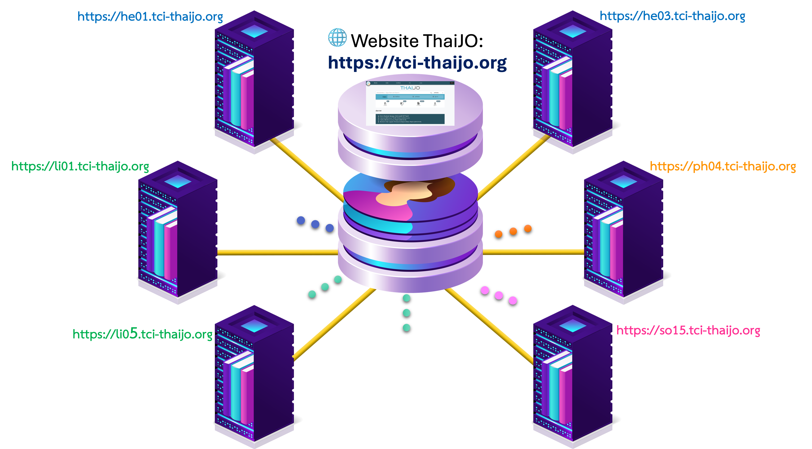

---
layout:
  width: default
  title:
    visible: true
  description:
    visible: false
  tableOfContents:
    visible: true
  outline:
    visible: true
  pagination:
    visible: true
  metadata:
    visible: true
---

# 8. การเพิ่ม/ลดตำแหน่งให้กับผู้ใช้ (User)


**เงื่อนไข**

* ผู้ใช้ (User) ต้องอยู่ใน <mark style="color:red;">**โดเมนเดียวกันกับวารสาร**</mark>



### <mark style="color:green;">✅</mark> <mark style="color:$success;">วิธีการจัดการ</mark>

1. ไปที่เมนู **Users & Roles** → **Users** → **Search**
2. **พิมพ์ Email** ของผู้ใช้ → **กดปุ่ม Search**


* หากผู้ใช้อยู่นอกวารสาร ให้เลือก **Include users with no roles in this journal**
* หากผู้ใช้เป็นสมาชิกวารสารอยู่แล้ว ไม่ต้องเลือก


3. เมื่อพบผู้ใช้ที่ต้องการ ให้คลิก **ลูกศรหน้าชื่อผู้ใช้** → **Edit Role**

<figure><figcaption></figcaption></figure>

4. **แต่งตั้งตำแหน่ง** (ติ๊กเลือก) หรือ **ยกเลิกตำแหน่ง** (เอาติ๊กออก) → กด **Save**

<figure><figcaption></figcaption></figure>


**หมายเหตุ**

* ไม่จำเป็นต้องเลือกตำแหน่งเหมือนภาพตัวอย่าง ให้เลือกเฉพาะตำแหน่งที่ต้องการแต่งตั้งหรือยกเลิก ตามความเหมาะสมในแต่ละกรณี
* หากบรรณาธิการคนใหม่ (Editor) ยังไม่มีบัญชีผู้ใช้ (User) ให้สมัครสมาชิกวารสารก่อน จากนั้นให้ผู้อื่นที่มีตำแหน่ง **ผู้จัดการวารสาร (Journal manager: JM)** หรือ **บรรณาธิการ (Journal editor: JE)** ในวารสารแต่งตั้งตำแหน่งเป็น **บรรณาธิการ (Journal editor: JE)** ให้กับบัญชีผู้ใช้ (User) ของบรรณาธิการใหม่
* ผู้ใช้สามารถมีได้มากกว่า 1 ตำแหน่ง และต้องมีอย่างน้อย 1 ตำแหน่งเสมอ

