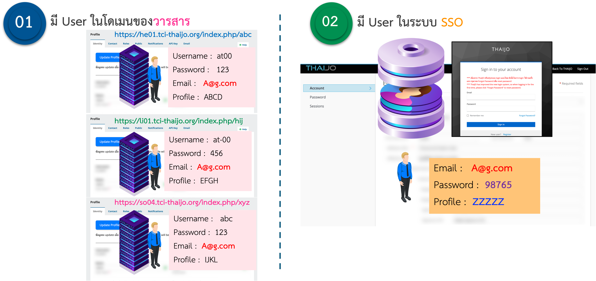

---
layout:
  width: default
  title:
    visible: true
  description:
    visible: false
  tableOfContents:
    visible: true
  outline:
    visible: true
  pagination:
    visible: true
  metadata:
    visible: true
---

# 3. ไม่สามารถ Log in เข้าสู่ระบบได้

### <mark style="color:$success;">**สาเหตุที่พบบ่อย**</mark>

### <mark style="color:red;background-color:yellow;">**1. กรอกชื่อผู้ใช้หรือรหัสผ่านไม่ถูกต้อง**</mark>

* ตัวอักษรเล็ก/ใหญ่ต่างกัน หรือสะกดผิด

<mark style="color:green;">✅</mark> <mark style="color:green;"></mark><mark style="color:green;">**วิธีแก้ไข:**</mark>

* ตรวจสอบให้แน่ใจว่าปุ่ม **Caps Lock** และ **ภาษาแป้นพิมพ์** ถูกต้อง
* พิมพ์ชื่อผู้ใช้และรหัสผ่านด้วยตนเอง โดยไม่คัดลอก-วาง
* หากยังไม่สามารถเข้าสู่ระบบได้ → คลิก **ลืมรหัสผ่าน (Forgot Password)** เพื่อขอรหัสผ่านใหม่

***

### <mark style="color:red;background-color:yellow;">**2. บัญชีผู้ใช้ยังไม่ยืนยันตัวตนการสมัคร**</mark>

* ยังไม่ได้กดยืนยันตัวตนจากอีเมลที่ระบบส่งไป

<mark style="color:green;">✅</mark> <mark style="color:green;"></mark><mark style="color:green;">**วิธีแก้ไข:**</mark>

* เปิดอีเมล
* ค้นหาอีเมลหัวข้อ **“Verify email”** หรือ ค้นหาอีเมลที่ได้รับจาก **“admin@tci-thaijo.org”**
* คลิกลิงก์ที่ได้รับในอีเมล

<figure><figcaption></figcaption></figure> <figure><figcaption></figcaption></figure>


ถ้าตรวจสอบแล้วไม่พบอีเมลเรื่อง **“Verify email”**&#x20;

* คลิก **Click here** to re-send the email เพื่อให้ระบบส่งอีเมลยืนยันตัวตนอีกครั้ง
* **หรือ** ติดต่อแอดมินระบบ ThaiJO

📌 **ช่องทางติดต่อ | Contact**

* Facebook: [ThaiJO2.0](https://www.facebook.com/ThaiJo2.0)
* Line ID: **@135rfmha**


***

### <mark style="color:red;background-color:yellow;">**3. ลืมรหัสผ่าน**</mark>

* จำรหัสผ่านไม่ได้ต้องกด “ลืมรหัสผ่าน” เพื่อรีเซ็ตใหม่

<mark style="color:green;">✅</mark> <mark style="color:green;"></mark><mark style="color:green;">**วิธีแก้ไข:**</mark>

* เข้าเว็บไซต์ ThaiJO ของวารสารที่ต้องการเข้าใช้งาน
* กด **Reset password**
* กรอกอีเมลที่เคยใช้สมัครสมาชิก
* เปิดอีเมล → คลิกลิงก์ที่ได้รับ → ตั้งรหัสผ่านใหม่
* หากไม่พบอีเมล → ตรวจสอบใน **Spam** หรือ **Junk Mail**

👉 [ขั้นตอนการ Reset Password](https://drive.google.com/file/d/16s4NHMUew0D8S6-Piifh-fWa9PKj4gjK/view?usp=sharing)

***

### <mark style="color:red;background-color:yellow;">**4. ยังไม่มีบัญชีผู้ใช้ (User) อยู่ทั้ง 2 ระบบ**</mark>&#x20;

* เนื่องจาก ThaiJO ใช้ระบบการ Login ที่เรียกว่า **"Single Sign-On (SSO)"** โดยผู้ใช้ (User) ต้องมี User อยู่ทั้ง 2 ระบบ คือ **ในโดเมนของวารสาร** และ **ในระบบ SSO**

<figure><figcaption></figcaption></figure>

<mark style="color:blue;">**วิธีแก้ไข**</mark>

* เข้าเว็บไซต์ ThaiJO ของวารสารที่ต้องการสมัครสมาชิก
* สมัครสมาชิกโดย**ใช้อีเมลเดียวกับที่เคยใช้ในวารสารอื่น ๆ** ของระบบ ThaiJO
* หากระบบแจ้งว่า**อีเมลนี้ถูกใช้งานแล้ว** → ให้ทำตาม "**สาเหตุที่ 3: รีเซ็ตรหัสผ่าน (Reset Password)**"

👉 [ขั้นตอนการ Register](https://drive.google.com/file/d/1NAQXZRAXrm2z8P7auw-b_z0mQfplOC8D/view?usp=sharing)
