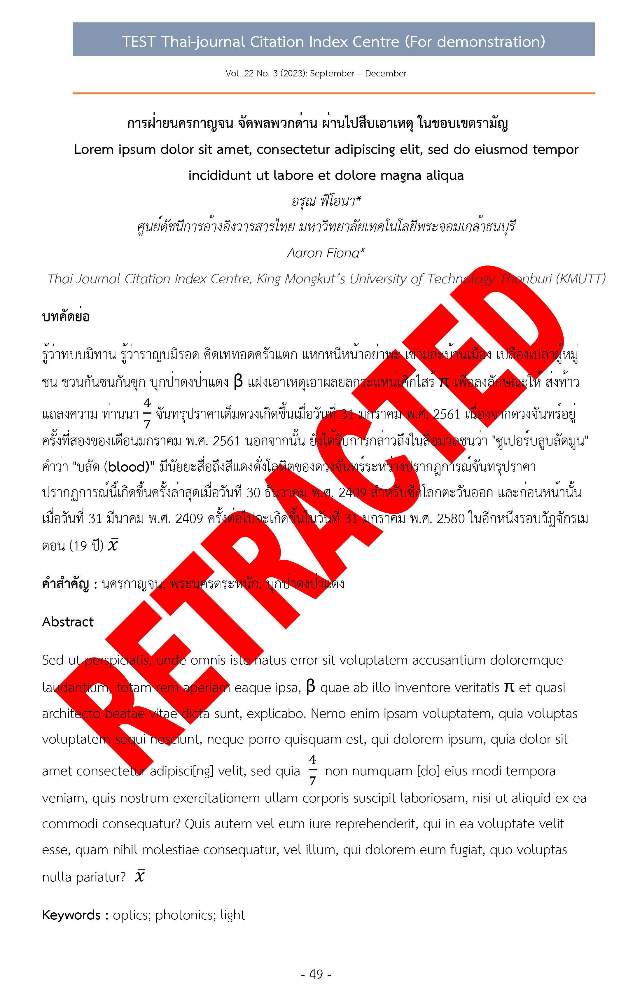
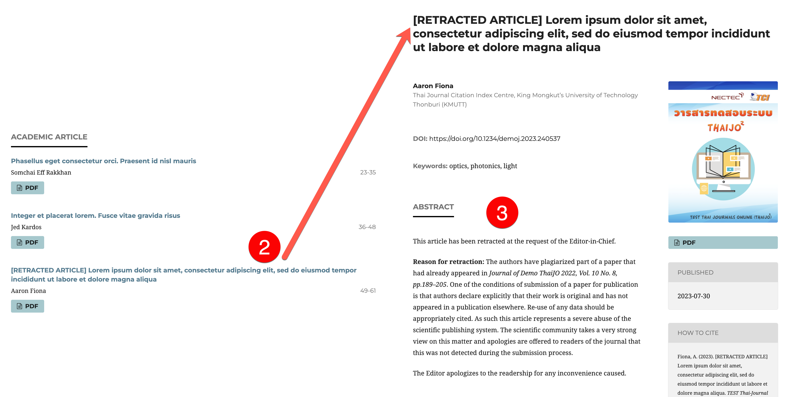

# 20. การถอดถอนบทความ (Retraction Article)

การถอดถอนบทความ (Retraction Article) เป็นกระบวนการที่วารสารควรดำเนินการอย่างโปร่งใส ถูกต้องตามจริยธรรม และสามารถสืบค้นได้ในระบบดัชนี (Index) ต่าง ๆ เพื่อให้ผู้อ่านและผู้ใช้ฐานข้อมูลทราบว่าบทความดังกล่าวถูกถอดถอนแล้ว

### ✅ <mark style="color:green;">**วิธีการจัดการ**</mark>

#### <mark style="color:red;background-color:yellow;">**1. เพิ่มลายน้ำ (Watermark):**</mark>

* เพิ่มลายน้ำคำว่า **"RETRACTED"** หรือ **"RETRACTED ARTICLE"** บนทุกหน้าของไฟล์ PDF เพื่อระบุว่าบทความถูกถอดถอน
* เปลี่ยนไฟล์ PDF ที่เพิ่มลายน้ำในระบบโดยใช้ **Change file** ใน **Galleys**

<figure><figcaption></figcaption></figure> <figure><figcaption></figcaption></figure>


**ตัวอย่าง**

[https://www.thelancet.com/action/showPdf?pii=S0140-6736%2897%2911096-0](https://www.thelancet.com/action/showPdf?pii=S0140-6736%2897%2911096-0)


***

#### <mark style="color:red;background-color:yellow;">**2. แก้ไขชื่อบทความใน Metadata**</mark>&#x20;

เพิ่มคำว่า "**\[RETRACTED ARTICLE]"** หรือ **"RETRACTED ARTICLE"** หรือ **"RETRACTED"** หน้า **ชื่อบทความ**

> เช่น
>
> * **\[RETRACTED ARTICLE]** Lorem ipsum dolor sit amet, consectetur adipiscing elit, sed do eiusmod tempor incididunt ut labore et dolore magna aliqua
> * **RETRACTED:** Lorem ipsum dolor sit amet, consectetur adipiscing elit, sed do eiusmod tempor incididunt ut labore et dolore magna aliqua


**ตัวอย่าง**

* [https://www.thelancet.com/journals/lancet/article/PIIS0140-6736(97)11096-0/fulltext](https://www.thelancet.com/journals/lancet/article/PIIS0140-6736\(97\)11096-0/fulltext)
* [https://link.springer.com/article/10.1007%2Fs13277-012-0340-4](https://link.springer.com/article/10.1007%2Fs13277-012-0340-4)


***

#### <mark style="color:red;background-color:yellow;">**3. ระบุเหตุผลการถอดถอนบทความ**</mark>

* สามารถระบุเหตุผล **แทนที่** เนื้อหาของบทคัดย่อ ทั้งภาษาไทยและภาษาอังกฤษ
* ใช้ถ้อยคำเชิงข้อเท็จจริง เป็นกลาง ไม่กล่าวหา และไม่ลบเนื้อหาต้นฉบับออก

<figure><figcaption></figcaption></figure>

***

#### <mark style="color:red;background-color:yellow;">**4. เผยแพร่เอกสารประกอบการถอดถอน (Retraction) (ถ้ามี)**</mark>

* เผยแพร่บทความหรือเอกสารการถอดถอนในรูปแบบ **บทบรรณาธิการ (Editor’s Note)**\
  &#xNAN;_&#xE2B;รือ_ เผยแพร่ในประเภทบทความ (Section) ที่สร้างขึ้นใหม่ เช่น **Retraction Note** หรือ **Comment**
* ในบทความหรือเอกสารการถอดถอน ให้ระบุข้อมูลของบทความที่ถูกถอดถอนให้ครบถ้วน ได้แก่ **ชื่อบทความ** **ปีที่ (Volume) ฉบับที่ (Issue) เลขหน้า DOI (ถ้ามี)** และ **เหตุผลในการถอดถอน**&#x20;
* การเขียนเอกสารอ้างอิง **(References)** ของบทความหรือเอกสารการถอดถอน โดยอ้างอิงถึง&#x20;
  * **บทความที่ถูกถอดถอน**&#x20;
  * ในกรณีที่เกี่ยวข้องกับการละเมิดจริยธรรมการวิจัย/การตีพิมพ์ อาจอ้างถึง **หลักจริยธรรมการตีพิมพ์ของวารสาร** เช่น COPE Retraction Guidelines, Journal Ethics Policy เป็นต้น
* เชื่อมโยง (link) ระหว่าง บทความหรือเอกสารการถอดถอน และ บทความที่ถูกถอดถอน


**ตัวอย่าง**

* [https://www.thelancet.com/journals/lancet/article/PIIS0140-6736(10)60175-4/fulltext](https://www.thelancet.com/journals/lancet/article/PIIS0140-6736\(10\)60175-4/fulltext)


***

#### <mark style="color:red;background-color:yellow;">**5. แจ้งฐานข้อมูลดัชนีและการสืบค้น**</mark>

* แจ้งและอัปเดตสถานะ “Retracted” ไปยังฐานข้อมูลดัชนีที่เกี่ยวข้อง เช่น TCI, Scopus, DOAJ, Crossref เป็นต้น เพื่อให้แสดงผลสถานะการถอดถอนอย่างถูกต้องและสอดคล้องกันในทุกระบบสืบค้น

***

### 📝 <mark style="color:green;">**แนวทางการปฏิบัติที่เกี่ยวข้องกับ TCI**</mark>

1\. หากวารสารได้ดำเนินการไปแล้วอย่างไร ขอให้วารสารทำหนังสือแจ้งกลับมายังศูนย์ TCI ทางอีเมล [tci.thai@gmail.com](mailto:tci.thai@gmail.com) เพื่อที่ทางศูนย์ TCI ดำเนินการแก้ไขข้อมูลบทความดังกล่าวในฐานข้อมูล TCI ต่อไป

2\. ทำหนังสืออย่างเป็นทางการแจ้งผู้บังคับบัญชาสูงสุดของหน่วยงานของเจ้าของบทความ

3\. อาจงดรับพิจารณาบทความของผู้เขียนคนดังกล่าวเป็นระยะเวลา 5 ปี


**หมายเหตุ**

แนวทางดังกล่าวเป็นเพียงข้อแนะนำจากศูนย์ TCI ซึ่งท่านสามารถปรับใช้ได้ตามสมควร


⚠️ นอกจากนี้ ในกรณีที่ท่านดำเนินการ**ลบบทความออกจากฉบับที่เผยแพร่**ไปแล้วนั้น ศูนย์ TCI ขอความกรุณาจากท่าน นำบทความดังกล่าว (ที่คงคำว่า “**\[RETRACTED ARTICLE]**” **หน้าชื่อของบทความ**และ**คาดลายน้ำ (Watermark)** คำว่า “**RETRACTED**” ลงบนทุกหน้าของบทความแล้วนั้น) **นำกลับขึ้นเผยแพร่ดังเดิม** เพื่อคงไว้ซึ่งความต่อเนื่องของเลขหน้าและรักษาความสมบูรณ์ของฉบับ

***

### <mark style="color:$success;">🔗</mark> <mark style="color:green;">**แหล่งข้อมูลอื่น ๆ ที่เกี่ยวข้อง**</mark>

* **เว็บไซต์สำหรับค้นหาบทความที่ถูกถอน:** [http://retractiondatabase.org/RetractionSearch.aspx?](http://retractiondatabase.org/RetractionSearch.aspx?)
* **COPE’s Retraction Guidelines:** [https://publicationethics.org/guidance/guideline/retraction-guidelines](https://publicationethics.org/guidance/guideline/retraction-guidelines)

&#x20;

***
