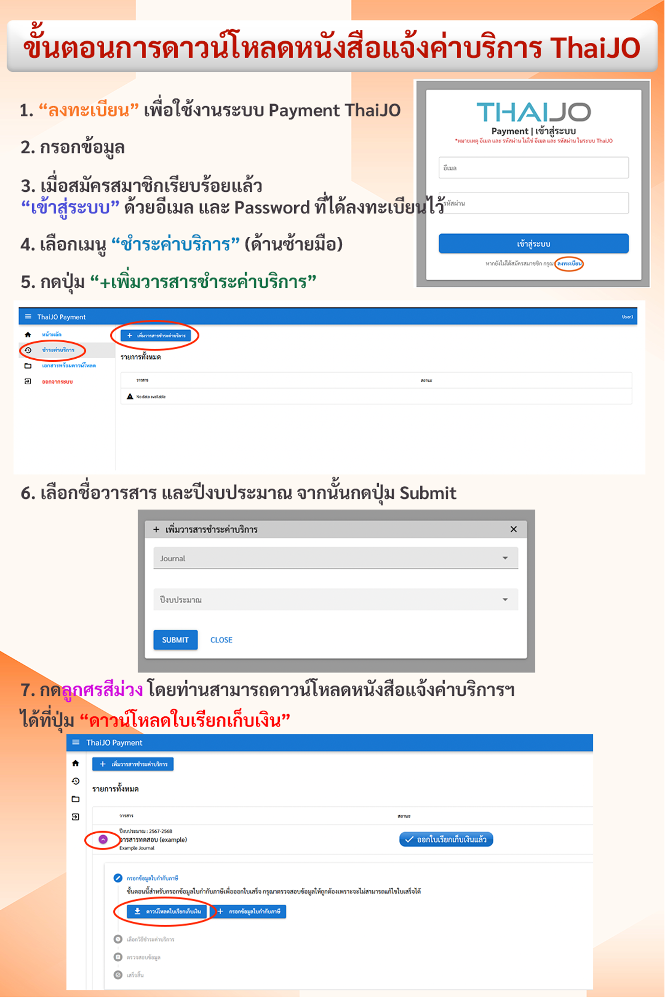

---
layout:
  width: default
  title:
    visible: true
  description:
    visible: false
  tableOfContents:
    visible: true
  outline:
    visible: true
  pagination:
    visible: true
  metadata:
    visible: true
---

# 2. การเรียกเก็บค่าบริการระบบ ThaiJO

### <mark style="color:$success;">**ตอบ**</mark>

* ค่าบริการระบบ ThaiJO **เรียกเก็บทุก 2 ปี** วารสารละ **10,000 บาท (หนึ่งหมื่นบาทถ้วน)**
  * ยังไม่รวม **ภาษีมูลค่าเพิ่ม (VAT)**
  * ค่าบริการของทุกวารสารที่ใช้งานระบบ ThaiJO จะ **สิ้นสุดพร้อมกันสิ้นปี 2568**
* วารสารสามารถดำเนินการต่อไปนี้ได้ด้วยตนเองผ่าน <mark style="color:red;">**ระบบ Payment ThaiJO**</mark>
  * ดาวน์โหลด **หนังสือเรียกเก็บค่าบริการ** และเอกสารอื่น ๆ ที่เกี่ยวข้อง
  * แจ้งชำระค่าบริการ
  * ส่งหลักฐานการชำระ

<h3 align="center">📌 <a href="https://tci-thailand.org/view?slug=service_charge_of_the_thaijo"><strong>รายละเอียดเพิ่มเติมเกี่ยวกับการเรียกเก็บและการชำระค่าบริการ ThaiJO</strong> </a></h3>

<figure><figcaption></figcaption></figure>
