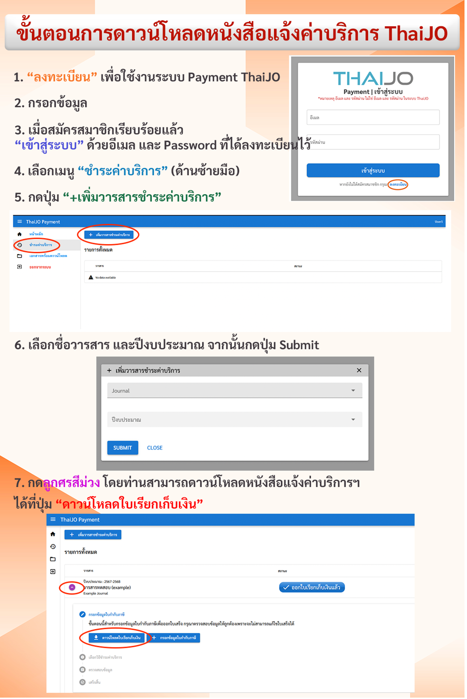

# 2. การเรียกเก็บค่าบริการระบบ ThaiJO

ศูนย์ TCI จะเรียกเก็บ **ค่าบริการระบบ ThaiJO&#x20;**<mark style="color:red;">**แบบรอบ 2 ปี**</mark> ในอัตรา <mark style="color:red;">**วารสารละ 10,000 บาท**</mark> (หนึ่งหมื่นบาทถ้วน) _<mark style="color:red;">ยังไม่รวมภาษีมูลค่าเพิ่ม (VAT)</mark>_ โดยค่าบริการของ _<mark style="color:orange;">**ทุกวารสาร**</mark>_ <mark style="color:orange;"></mark><mark style="color:orange;">จะสิ้นสุดในปีเดียวกัน</mark> ตามรายละเอียดต่อไปนี้

### <mark style="color:red;background-color:yellow;">ตารางอัตราค่าบริการระบบ ThaiJO (ชำระทุก 2 ปี)</mark>

<table><thead><tr><th width="86.293701171875" align="center">ลำดับ</th><th align="center">รายละเอียด</th><th align="center">ค่าบริการ</th><th align="center">ครอบคลุมปี พ.ศ.</th></tr></thead><tbody><tr><td align="center">1</td><td align="center">วารสารที่เปิดใช้งาน ThaiJO <mark style="color:blue;"><strong>ก่อน</strong></mark>ปี 2569</td><td align="center">10,700 บาท (รวม VAT 7%)</td><td align="center">2569 - 2570</td></tr><tr><td align="center">2</td><td align="center">วารสารที่เปิดใช้งาน ThaiJO ในปี 2569</td><td align="center">10,700 บาท (รวม VAT 7%)</td><td align="center">2569 - 2570</td></tr><tr><td align="center">3</td><td align="center">วารสารที่เปิดใช้งาน ThaiJO ในปี 2570</td><td align="center">5,000 บาท (<mark style="color:red;">ยังไม่รวม</mark> VAT*)</td><td align="center">2570</td></tr></tbody></table>


<mark style="color:red;">**หมายเหตุ\***</mark>

* ในปี พ.ศ. 2569 ศูนย์ TCI จะมีการ **ประกาศให้วารสารชำระค่าบริการฯ** ซึ่งจะครอบคลุมการใช้งานระบบในปี พ.ศ. 2569–2570
* อัตรา VAT จะเป็นไปตามประกาศราชกิจจานุเบกษาของปีที่มีการชำระค่าบริการ
* **ศูนย์ฯ จะ**<mark style="color:red;">**ไม่มีการจัดส่ง**</mark>**หนังสือเรียกเก็บค่าบริการให้โดยตรง**\
  วารสารต้องเข้าสู่ <mark style="color:red;">**ระบบ Payment ThaiJO:**</mark> [https://payment.tci-thaijo.org/](https://payment.tci-thaijo.org/) เพื่อ <mark style="color:purple;">**ดาวน์โหลดหนังสือเรียกเก็บ**</mark> <mark style="color:purple;">**แจ้งชำระเงิน**</mark> และ<mark style="color:purple;">**อัปโหลดหลักฐาน**</mark>ด้วยตนเอง\
  (ระบบ Payment ThaiJO เป็นระบบแยกจากระบบ ThaiJO และต้องสมัครสมาชิกใหม่ก่อนเข้าใช้งาน)
* สำหรับวารสารที่ประสงค์จะชำระค่าบริการ<mark style="color:red;">**แบบรายปี**</mark> สามารถเลือกวิธีการชำระแบบรายปีได้ในระบบ Payment ThaiJO


***

<h3 align="center">📌 <a href="https://tci-thailand.org/view?slug=service_charge_of_the_thaijo"><strong>รายละเอียดเพิ่มเติมเกี่ยวกับการเรียกเก็บและการชำระค่าบริการ ThaiJO</strong> </a></h3>

<figure><figcaption></figcaption></figure>
