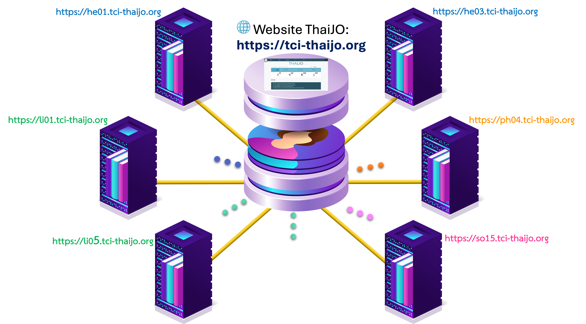

---
layout:
  width: default
  title:
    visible: true
  description:
    visible: false
  tableOfContents:
    visible: true
  outline:
    visible: false
  pagination:
    visible: true
  metadata:
    visible: true
---

# 📡 โดเมน (Domain) ในระบบ ThaiJO

## ระบบ ThaiJO แบ่งโดเมน (Domain) ตามสาขาหลักของวารสาร ดังนี้

<table data-full-width="true"><thead><tr><th width="389.711181640625" align="center">สาขาหลักของวารสาร</th><th align="center">จำนวนโดเมน</th></tr></thead><tbody><tr><td align="center"><mark style="color:blue;"><strong>Health Sciences (he)</strong></mark></td><td align="center">
<mark style="color:blue;"><strong>5</strong></mark>

<mark style="color:blue;">https://he01.tci-thaijo.org</mark>

<mark style="color:blue;">…</mark>

<mark style="color:blue;">https://he05.tci-thaijo.org</mark>
</td></tr><tr><td align="center"><mark style="color:$success;"><strong>Life Sciences (li)</strong></mark></td><td align="center">
<mark style="color:$success;"><strong>5</strong></mark>

<mark style="color:$success;">https://li01.tci-thaijo.org</mark>

<mark style="color:$success;">…</mark>

<mark style="color:$success;">https://li05.tci-thaijo.org</mark>
</td></tr><tr><td align="center"><mark style="color:orange;"><strong>Physical Sciences (ph)</strong></mark></td><td align="center">
<mark style="color:orange;"><strong>5</strong></mark>

<mark style="color:orange;">https://ph01.tci-thaijo.org</mark>

<mark style="color:orange;">…</mark>

<mark style="color:orange;">https://ph05.tci-thaijo.org</mark>
</td></tr><tr><td align="center"><mark style="color:red;"><strong>Social Sciences &#x26; Humanities (so)</strong></mark></td><td align="center">
<mark style="color:red;"><strong>20</strong></mark>

<mark style="color:red;">https://so01.tci-thaijo.org</mark>

<mark style="color:red;">…</mark>

<mark style="color:red;">https://so20.tci-thaijo.org</mark>
</td></tr><tr><td align="center"><strong>รวม</strong></td><td align="center"><strong>35</strong></td></tr></tbody></table>

<em>ข้อมูล ณ วันที่ 9 ม.ค. 66</em>

## 📍**โครงสร้างโดเมนและวารสาร**

<figure><figcaption>
โดเมนในระบบ ThaiJO
</figcaption></figure>

* แต่ละโดเมนมีวารสารอยู่ภายใน **(\~100 วารสาร/โดเมน)**
* การเข้าสู่ระบบจะใช้บัญชี **SSO** (Email + Password เดียว) ได้ทุกโดเมน


#### <mark style="color:red;">ข้อจำกัด</mark>❗️

* **การค้นหาผู้ใช้**หรือ**การมอบหมายบทบาท** (เช่น ผู้แต่ง ผู้ประเมิน หรือบรรณาธิการ) สามารถดำเนินการได้เฉพาะผู้ใช้ที่<mark style="color:red;">**อยู่ในโดเมนของวารสารเท่านั้น**</mark>&#x20;
* กรณีที่ผู้ใช้ยังไม่มีบัญชีอยู่ในโดเมนของวารสาร สามารถดำเนินการได้ดังนี้
  * วารสารสามารถสร้างบัญชีให้กับผู้ใช้โดยใช้ <mark style="color:purple;">**อีเมลเดิม**</mark> <mark style="color:green;">**เพื่อเชื่อมโยงกับ SSO**</mark> และมอบหมายบทบาทในวารสารได้
  * ผู้ใช้สามารถเข้าสู่เว็บไซต์ของวารสารด้วย <mark style="color:purple;">**อีเมลเดิม**</mark> <mark style="color:green;">**เพื่อเชื่อมโยงกับ SSO**</mark> และเพิ่มบทบาทผู้แต่งในวารสารได้ด้วยตนเอง


## 🔷 ตัวอย่าง

#### <mark style="color:blue;">**1. Health Sciences (he) - 5 โดเมน**</mark>

* <mark style="color:blue;">**โดเมน he01.tci-thaijo.org**</mark>
  * `https://`**`he01`**`.tci-thaijo.org/index.php/`**`nah`**
  * `https://`**`he01`**`.tci-thaijo.org/index.php/`**`JHematolTransfusMed`**
* <mark style="color:blue;">**โดเมน he02.tci-thaijo.org**</mark>
  * `https://`**`he02`**`.tci-thaijo.org/index.php/`**`jnphr`**
  * `https://`**`he02`**`.tci-thaijo.org/index.php/`**`jaas_muvs`**
* <kbd><mark style="color:blue;">...<mark style="color:blue;"></kbd>

***

#### <mark style="color:$success;">**2. Life Sciences (li) - 5 โดเมน**</mark>

* <mark style="color:$success;">**โดเมน li01.tci-thaijo.org**</mark>
  * `https://`**`li01`**`.tci-thaijo.org/index.php/`**`anres`**
  * `https://`**`li01`**`.tci-thaijo.org/index.php/`**`tnh`**
* <mark style="color:$success;">**โดเมน li02.tci-thaijo.org**</mark>
  * `https://`**`li02`**`.tci-thaijo.org/index.php/`**`ssstj`**
  * `https://`**`li02`**`.tci-thaijo.org/index.php/`**`JASM`**
* <kbd><mark style="color:green;">...<mark style="color:green;"></kbd>

***

#### <mark style="color:orange;">**3. Physical Sciences (ph) - 5 โดเมน**</mark>

* <mark style="color:orange;">**โดเมน ph01.tci-thaijo.org**</mark>
  * `https://`**`ph01`**`.tci-thaijo.org/index.php/`**`JIE`**
  * `https://`**`ph01`**`.tci-thaijo.org/index.php/`**`easr`**
* <mark style="color:orange;">**โดเมน ph02.tci-thaijo.org**</mark>
  * `https://`**`ph02`**`.tci-thaijo.org/index.php/`**`swujournal`**
  * `https://`**`ph02`**`.tci-thaijo.org/index.php/`**`gskku`**
* <kbd><mark style="color:orange;">...<mark style="color:orange;"></kbd>

***

#### <mark style="color:red;">**4. Social Sciences & Humanities (so) – 20 โดเมน**</mark>

* <mark style="color:red;">**โดเมน so01.tci-thaijo.org**</mark>
  * `https://`**`so01`**`.tci-thaijo.org/index.php/`**`NUR_YIU`**
  * `https://`**`so01`**`.tci-thaijo.org/index.php/`**`CBSReview`**
* <mark style="color:red;">**โดเมน so02.tci-thaijo.org**</mark>
  * `https://`**`so02`**`.tci-thaijo.org/index.php/`**`jica`**
  * `https://`**`so02`**`.tci-thaijo.org/index.php/`**`SNGSJ`**
* <kbd><mark style="color:red;">...<mark style="color:red;"></kbd>

***
