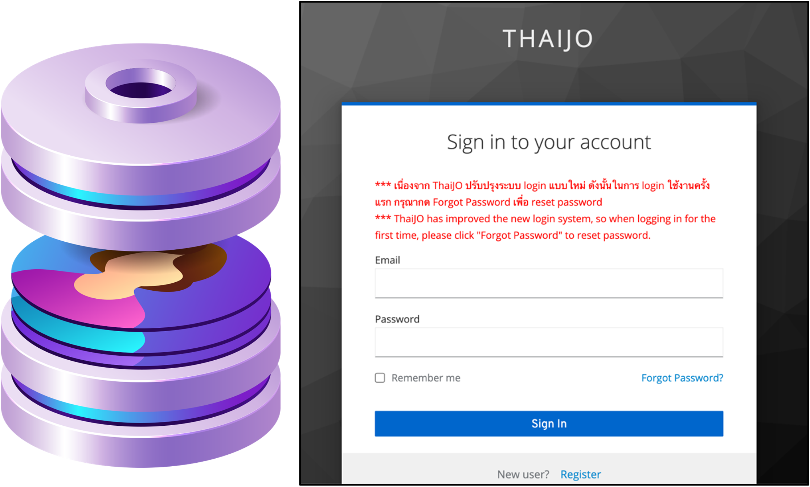
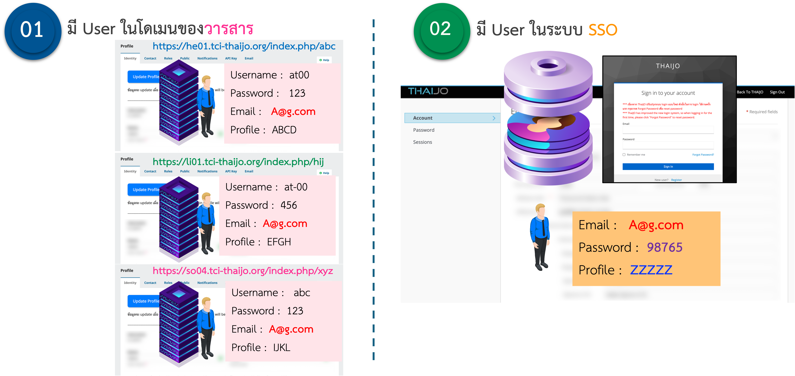

---
layout:
  width: default
  title:
    visible: true
  description:
    visible: false
  tableOfContents:
    visible: true
  outline:
    visible: false
  pagination:
    visible: true
  metadata:
    visible: true
---

# 👨‍👩‍👧‍👧 ระบบ Login กลาง เรียกว่า "Single Sign-On (SSO)"

<figure><figcaption>
ระบบ Login กลาง เรียกว่า "Single Sign-On (SSO)"
</figcaption></figure> <figure><figcaption>
ผู้ใช้ (User) ต้องมี User อยู่ทั้ง 2 ระบบ คือ ในโดเมนของวารสาร และ ในระบบ SSO
</figcaption></figure>

## 📌 หลักการทำงานของระบบผู้ใช้ (SSO) ใน ThaiJO

1. **บัญชีผู้ใช้แบบ SSO**
   * ผู้ใช้มีเพียง **1 บัญชี (Email + Password เดียว)** สำหรับเข้าสู่ระบบ **ทุกวารสารในทุกโดเมนของ ThaiJO**
   * ไม่จำเป็นต้องสมัครใหม่เมื่อใช้งานในวารสารหรือโดเมนอื่น
2. **การกำหนดบทบาท (Role)**
   * ผู้ใช้ 1 คนสามารถมีบทบาทได้หลายแบบ เช่น
     * ผู้แต่ง (Author)
     * ผู้ประเมิน (Reviewer)
     * บรรณาธิการ (Journal Editor)
   * สามารถมีบทบาทข้ามวารสารและข้ามโดเมนได้ โดย**ใช้บัญชีเดียว**กัน
3. **สิทธิการใช้งานในแต่ละวารสาร**
   * เมื่อเข้าสู่ระบบด้วย Email + Password เดียว ผู้ใช้สามารถ
     * **ส่งบทความ**  (ผู้แต่ง) ไปยังวารสารใดก็ได้ที่เปิดรับ
     * **เข้ารับบทบาท** (เช่น ผู้แต่ง ผู้ประเมิน บรรณาธิการ) ในหลายวารสารได้
   * แต่ละวารสารจะยังคง **กำหนดบทบาทของผู้ใช้นั้นแยกกัน** เช่น
     * ในวารสาร A → เป็นผู้แต่ง
     * ในวารสาร B → เป็นผู้ประเมิน
     * ในวารสาร C → เป็นทั้งผู้แต่งและผู้ประเมิน


## <mark style="color:red;">ข้อจำกัด</mark>❗️ 
การ<ins>ค้นหา</ins>ผู้ใช้เพื่อนำไป**มอบหมายบทบาท** เช่น ผู้ประเมิน หรือบรรณาธิการ ผู้ใช้นั้น<mark style="color:red;">**ต้องมีบัญชีอยู่ในโดเมนเดียวกัน**</mark> หากยังไม่มีบัญชี ผู้ใช้สามารถเข้าสู่เว็บไซต์วารสารของโดเมนอื่นโดยใช้ <mark style="color:purple;">**อีเมลเดิม**</mark> เพื่อเพิ่มบทบาทในวารสาร หรือวารสารสามารถสร้างบัญชีให้กับผู้ใช้โดยใช้ <mark style="color:purple;">**อีเมลเดิม**</mark>**&#x20;**<mark style="color:green;">**เพื่อเชื่อมโยงกับ SSO**</mark>

