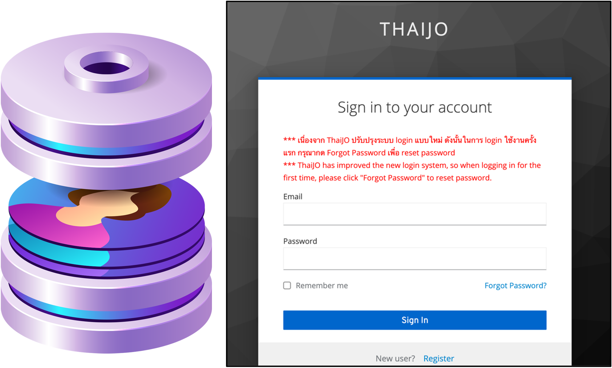
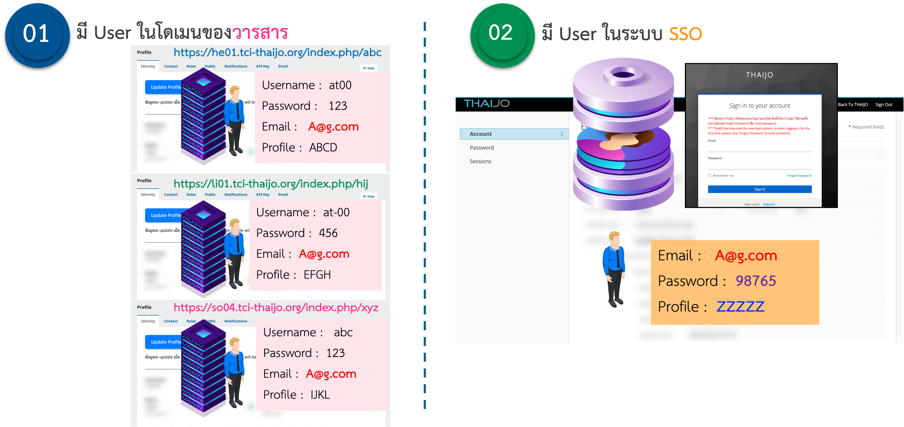

---
layout:
  width: default
  title:
    visible: true
  description:
    visible: false
  tableOfContents:
    visible: true
  outline:
    visible: false
  pagination:
    visible: true
  metadata:
    visible: true
---

# 👨‍👩‍👧‍👧 ระบบ Login กลาง เรียกว่า "Single Sign-On (SSO)"

<figure><figcaption>
ระบบ Login กลาง เรียกว่า "Single Sign-On (SSO)"
</figcaption></figure> <figure><figcaption>
ผู้ใช้ (User) ต้องมี User อยู่ทั้ง 2 ระบบ คือ ในโดเมนของวารสาร และ ในระบบ SSO
</figcaption></figure>

## 📌 หลักการทำงานของระบบผู้ใช้ (SSO) ใน ThaiJO

1. **บัญชีผู้ใช้แบบ SSO**
   * ผู้ใช้มีเพียง **1 บัญชี** <mark style="color:red;">**(Email + Password เดียว)**</mark> สำหรับเข้าสู่ระบบ <mark style="color:red;">**ทุกวารสารในทุกโดเมนของ ThaiJO**</mark>
   * ไม่จำเป็นต้องสมัครใหม่เมื่อใช้งานในวารสารหรือโดเมนอื่น
2. **การกำหนดบทบาท (Role)**
   * ผู้ใช้ 1 คนสามารถมีบทบาทได้หลายแบบ เช่น
     * ผู้แต่ง (Author)
     * ผู้ประเมิน (Reviewer)
     * บรรณาธิการ (Journal Editor)
   * สามารถมีบทบาทข้ามวารสารและข้ามโดเมนได้ โดย<mark style="color:red;">**ใช้บัญชีเดียว**</mark>กัน
3. **สิทธิการใช้งานในแต่ละวารสาร**
   * เมื่อเข้าสู่ระบบด้วย Email + Password เดียว ผู้ใช้สามารถมีบทบาทได้ในหลายวารสาร พร้อมสิทธิ์ตามบทบาทนั้น ๆ ได้แก่:
     * **ผู้แต่ง (Author)** → ส่งบทความไปยังวารสารที่เปิดรับบทความ
     * **ผู้ประเมิน (Reviewer)** → ประเมินบทความในวารสารที่ได้รับเชิญ
     * **บรรณาธิการ (Editor)** → จัดการบทความและตัดสินบทความในวารสารที่ได้รับสิทธิ์
   * แต่ละวารสารจะยังคง **กำหนดบทบาทของผู้ใช้นั้นแยกกัน** เช่น
     * ในวารสาร A → เป็นผู้แต่ง
     * ในวารสาร B → เป็นบรรณาธิการ
     * ในวารสาร C → เป็นทั้งผู้แต่งและผู้ประเมิน


#### <mark style="color:red;">เงื่อนไขในการค้นหาและเพิ่มบทบาทผู้ใช้</mark>❗️

* ผู้ใช้นั้น<mark style="color:red;">**ต้องมีบัญชีอยู่ในวารสารที่อยู่ในโดเมนเดียวกัน**</mark>&#x20;
* หากผู้ใช้นั้น _<mark style="color:red;">**ไม่มี**</mark>_<mark style="color:red;">**&#x20;**</mark><mark style="color:red;">**บัญชีอยู่ในโดเมนของวารสาร**</mark>:
  * วารสารสามารถสร้างบัญชีให้กับผู้ใช้โดยใช้ <mark style="color:purple;">**อีเมลเดิม**</mark> <mark style="color:green;">**เพื่อเชื่อมโยงกับ SSO**</mark> และมอบหมายบทบาทในวารสารได้
  * ผู้ใช้สามารถเข้าสู่เว็บไซต์ของวารสารด้วย <mark style="color:purple;">**อีเมลเดิม**</mark> <mark style="color:green;">**เพื่อเชื่อมโยงกับ SSO**</mark> และเพิ่มบทบาทเป็น ผู้อ่าน หรือ ผู้แต่งในวารสารได้ด้วยตนเอง

