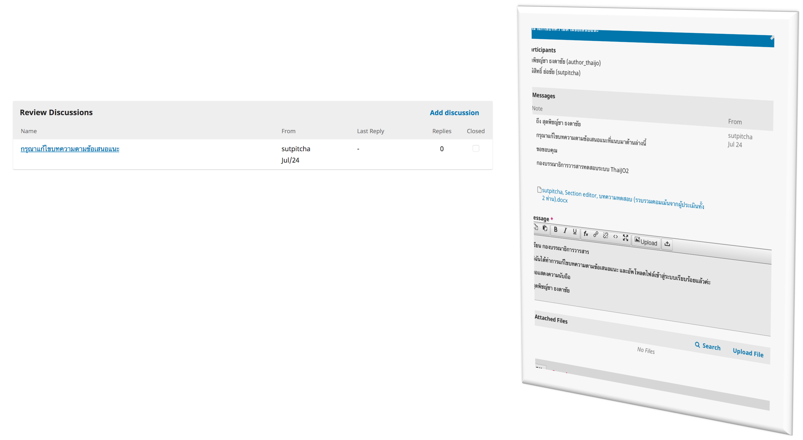
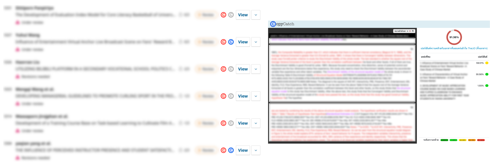
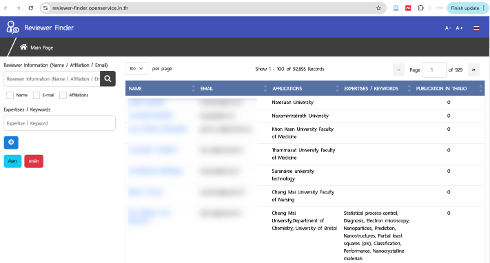

---
layout:
  width: default
  title:
    visible: true
  description:
    visible: true
  tableOfContents:
    visible: true
  outline:
    visible: true
  pagination:
    visible: true
  metadata:
    visible: true
---

# 👍 Feature  ที่น่าสนใจระบบ ThaiJO

## 🔔 <mark style="color:red;">กระทู้สนทนา: Discussions</mark>

เพื่อใช้ในการติดต่อสื่อสารกันในระบบ และมีอยู่ในทุกสถานะของบทความ


**ตัวอย่างการแแสดงผล**


<figure><figcaption></figcaption></figure>

***

## <mark style="color:red;">©️ CopyCatch :</mark> ระบบตรวจสอบความคล้ายในระบบ ThaiJO

การตรวจสอบความคล้ายมีอยู่ 2 แบบ คือ

<figure><figcaption></figcaption></figure>

**✅ แบบที่ 1:** 🔎 ตรวจสอบบทความที่ **Submission (Submission Files)** <mark style="color:orange;">**เทียบกับ**</mark> **บทความในกระบวนการที่ยังไม่เผยแพร่ (Unublished)** ในระบบ ThaiJO

<figure><figcaption></figcaption></figure>

**✅ แบบที่ 2:** 🔎 ตรวจสอบบทความที่ Submission **(Submission Files)** หรือ Review (**Revisions)** <mark style="color:orange;">**เทียบกับ**</mark> **บทความที่เผยแพร่แล้ว (Published**) ในระบบ ThaiJO

***


**ตัวอย่างการแสดงผล**


<figure><figcaption></figcaption></figure>

***

## <mark style="color:red;">👩‍💼👨‍💼 Reviewer Finder</mark>

ระบบช่วย ค้นหาและแนะนำผู้ทรงคุณวุฒิ (Reviewer)


**ตัวอย่างการแสดงผล**


<figure><figcaption></figcaption></figure>

<h4 align="center">Website : <a href="https://reviewer-finder.openservice.in.th/">https://reviewer-finder.openservice.in.th/
</a></h4>

***

## 🎖 <mark style="color:red;">Reviewer Recognition and Certificates</mark>

เพื่อยกย่องและเชิดชูเกียรติผู้ทรงคุณวุฒิที่มีส่วนสำคัญในการประเมินผลงานวิชาการของวารสารไทย


**ตัวอย่างการแสดงผล**


<figure><figcaption></figcaption></figure>
