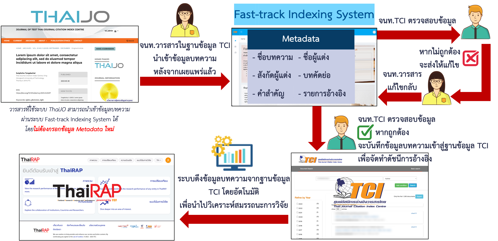

---
layout:
  width: wide
  title:
    visible: true
  description:
    visible: false
  tableOfContents:
    visible: true
  outline:
    visible: false
  pagination:
    visible: true
  metadata:
    visible: true
---

# 🪢 การเชื่อมโยงข้อมูลระหว่าง ThaiJO, TCI และ ThaiRAP

<figure><figcaption></figcaption></figure>

***

## 🔗 <mark style="color:$success;">การเชื่อมโยงข้อมูลระหว่างระบบ</mark>

### 📙 <mark style="color:blue;">ThaiJO →</mark> 📚 <mark style="color:blue;">TCI</mark>

บรรณาธิการ/เจ้าหน้าที่วารสารนำเข้าข้อมูลบทความจากระบบ ThaiJO ไปยังฐานข้อมูล TCI <mark style="color:$danger;">**ผ่านระบบ Fast-Track Indexing System**</mark> จากนั้นเจ้าหน้าที่ TCI ตรวจสอบความถูกต้องของข้อมูลบทความและบันทึกเข้าสู่ฐานข้อมูล TCI เพื่อใช้ในการอ้างอิงวารสารในฐานข้อมูล TCI

### 📚 <mark style="color:blue;">TCI →</mark> 📈 <mark style="color:blue;">ThaiRAP</mark>

ข้อมูลบทความที่อยู่ในฐานข้อมูล TCI จะถูกนำเข้าระบบ ThaiRAP <mark style="color:$danger;">**โดยอัตโนมัติ**</mark>เพื่อใช้ในการวิเคราะห์สมรรถนะงานวิจัยของประเทศ
