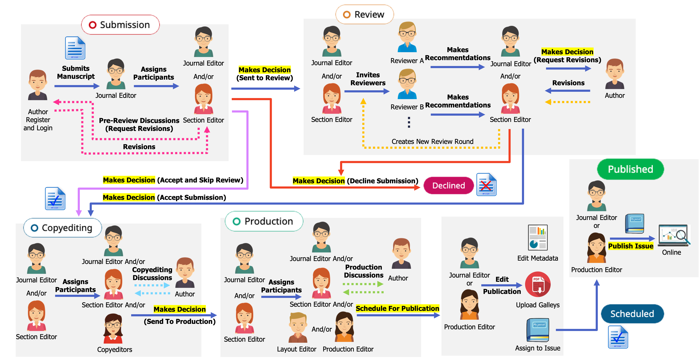

---
layout:
  width: wide
  title:
    visible: true
  description:
    visible: false
  tableOfContents:
    visible: true
  outline:
    visible: true
  pagination:
    visible: true
  metadata:
    visible: true
---

# ⚙️ Editorial Workflow and Publication Process

<figure><figcaption></figcaption></figure>


# แนวปฏิบัติ

<mark style="color:orange;background-color:purple;">**บทความ 1 เรื่อง ควรมีเพียง 1 รหัส (ID) เท่านั้น**</mark>

โปรดดำเนินการกับบทความจนเสร็จสิ้นกระบวนการ (ไม่รับตีพิมพ์ – Declined❌ _หรือ_ เผยแพร่ – Published✅) เพื่อป้องกันความซ้ำซ้อน

